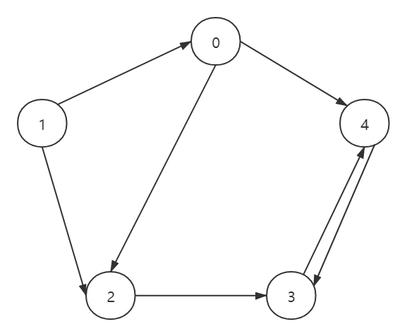
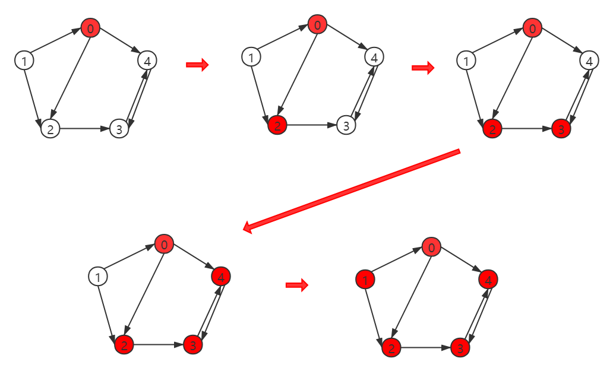
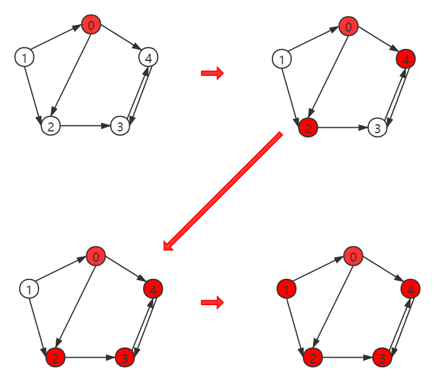

### 构造邻接矩阵



```c++
#include <stdio.h>
int main() {
	const int MAX_N = 5; // 一共有五个顶点 
	int G[MAX_N][MAX_N] = {};	// 使用邻接矩阵表示
	G[0][2] = 1; 	// 将图连通且不带权
	G[0][4] = 1; 
	G[1][0] = 1; 
	G[1][2] = 1; 
	G[2][3] = 1; 
	G[3][4] = 1;
	G[4][3] = 1;
	printf("G:\n");
	for(int i=0; i<5; i++) {
        for(int j=0; j<5; j++) {
            printf("%d",G[i][j]);
        }
        printf("\n"); 
	}
	return 0;
} 
```

### 邻接表

```c++
#include <stdio.h>
#include <vector>
using namespace std;

struct GNode{
	int val;
	vector<GNode*> neighbors;
	GNode(int x):val(x) {
	}
}; 

int main() {
	int MAX_N = 5; // 五个节点
	GNode *Node[MAX_N];
	for(int i = 0; i < MAX_N; i++) {
		Node[i] = new GNode(i);
	}
	Node[0]->neighbors.push_back(Node[2]);
	Node[0]->neighbors.push_back(Node[4]);
	Node[1]->neighbors.push_back(Node[0]);
	Node[1]->neighbors.push_back(Node[2]);
	Node[2]->neighbors.push_back(Node[3]);
	Node[3]->neighbors.push_back(Node[4]);
	Node[4]->neighbors.push_back(Node[3]);
	printf("Node:\n");
	for(int i = 0; i < MAX_N; i++) {
		printf("Node[%d]:",i);
		for(int j = 0; j < Node[i]->neighbors.size(); j++) {
			printf("%d ",Node[i]->neighbors[j]->val);
		}
		printf("\n");
	}
	for (int i = 0; i < MAX_N; i++) {
		delete Node[i];
	}
	return 0;
}
```

### 图的深度优先遍历



1. 从图中某个顶点v出发，首先访问该顶点
2. 然后依次从它的各个未被访问的邻接点出发深度优先搜索遍历图
3. 直至图中所有和v有路径相通且未被访问的顶点都被访问到。 
4. 若此时尚有其他顶点未被访问到
5. 则另选一个未被访问的顶点作起始点，
6. 重复上述过程，直至图中所有顶点都被访问到为止。

```c++
#include <stdio.h>
#include <vector>
using namespace std;

struct GNode{
	int val;
	vector<GNode*> neighbors;
	GNode(int x):val(x){
	}
};

void DFSGraph(GNode *node, int visit[]) {
	visit[node->val] = 1;	// 标记已访问的顶点
	printf("%d ",node->val);
	for(int i = 0; i < node->neighbors.size(); i++) {
        if(visit[node->neighbors[i]->val] == 0) {
            DFSGraph(node->neighbors[i], visit);
        }
	} 
}

int main() {
	int MAX_N = 5;
	GNode *Node[MAX_N];
	for(int i = 0; i < MAX_N; i++) {
		Node[i] = new GNode(i);
	}
	Node[0]->neighbors.push_back(Node[2]);
	Node[0]->neighbors.push_back(Node[4]);
	Node[1]->neighbors.push_back(Node[0]);
	Node[1]->neighbors.push_back(Node[2]);
	Node[2]->neighbors.push_back(Node[3]);
	Node[3]->neighbors.push_back(Node[4]);
	Node[4]->neighbors.push_back(Node[3]);
	int visit[MAX_N] = {0};
	for(int i = 0; i < MAX_N; i++) {
        if(visit[i] == 0) { // 没有标记的顶点才会被访问 
            printf("From val(%d): ", Node[i]->val);
            DFSGraph(Node[i], visit);
            printf("\n");
        }
	}
	for (int i = 0; i < MAX_N; i++) {
        delete Node[i];
	}
	return 0;
}
```

### 图的广度优先遍历



1. 从图中某个顶点v出发，在访问了v之后依次访问v的各个未曾访问过的邻接点，
2. 然后分别从这些邻接点出发依次访问它们的邻接点，
3. 并使得"先被访问的顶点的邻接点先于后被访问的顶点的邻接点被访问"，
4. 直至图中所有已被访问的顶点的邻接点都被访问到。
5. 如果此时图中尚有顶点未被访问，
6. 则需要另选一个未曾被访问过的顶点作为新的起始点，
7. 重复上述过程，直至图中所有顶点都被访问到为止。

```c++
#include <stdio.h>
#include <vector>
#include <queue> 
using namespace std;

struct GNode{
	int val;
	vector<GNode*> neighbors;
	GNode(int x):val(x){
	}
};

void BFSGraph(GNode *node, int visit[]) {
	queue<GNode*> q;	// 广度优先搜索使用队列 
	q.push(node);
	visit[node->val] = 1;	// 标记已访问的顶点
	while(!q.empty()){
		GNode *temp = q.front();
		q.pop();
		printf("%d ",temp->val);
		for(int i = 0; i < temp->neighbors.size(); i++) {
			if(visit[temp->neighbors[i]->val] == 0) {
				q.push(temp->neighbors[i]);
				visit[temp->neighbors[i]->val] = 1;
			}
		} 
	} 

}

int main() {
	int MAX_N = 5;
	GNode *Node[MAX_N];
	for(int i = 0; i < MAX_N; i++) {
		Node[i] = new GNode(i);
	}
	Node[0]->neighbors.push_back(Node[2]);
	Node[0]->neighbors.push_back(Node[4]);
	Node[1]->neighbors.push_back(Node[0]);
	Node[1]->neighbors.push_back(Node[2]);
	Node[2]->neighbors.push_back(Node[3]);
	Node[3]->neighbors.push_back(Node[4]);
	Node[4]->neighbors.push_back(Node[3]);
	int visit[MAX_N] = {0};
	for(int i = 0; i < MAX_N; i++) {
		if(visit[i] == 0) { // 没有标记的顶点才会被访问 
			printf("From val(%d): ", Node[i]->val);
			BFSGraph(Node[i], visit);
			printf("\n");
		}
	}
	for (int i = 0; i < MAX_N; i++) {
		delete Node[i];
	}
	return 0;
}
```

