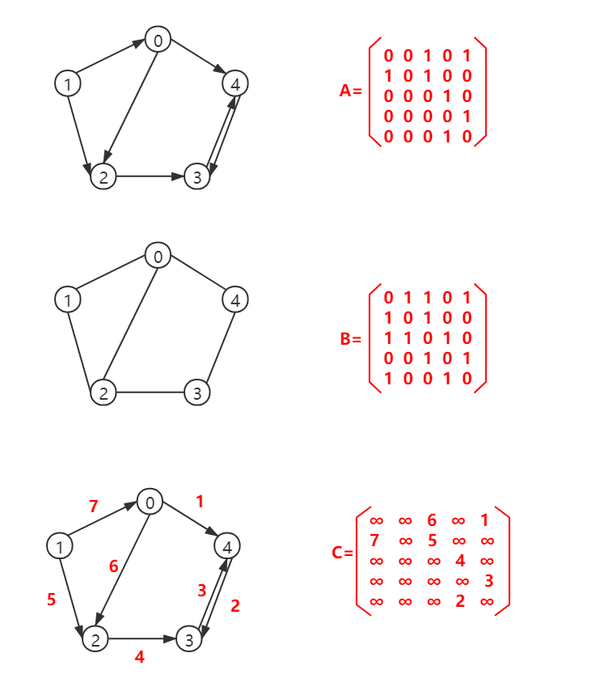

#### 一、图的基本概念

**图：**图G是一个有序二元组(V,E)，其中V称为顶集(Vertices Set)，E称为边集(Edges set)，E与V不相交。它们亦可写成V(G)和E(G)。其中，顶集的元素被称为顶点(Vertex)，边集的元素被称为边(edge)。


**有向图：**若E是有向边（也称弧）的有限集合时，则图G为有向图。弧是顶点的有序对，记为 $<v,w>$ ，称为从顶点v到顶点w的弧。如上图中（a）：$G_1=(V_1,E_1)||V_1=\{1,2,3\}||E_1=\{<1,2>,<2,1>,<2,3>\}$

**无向图：**若E是无向边（简称边）的有限集合时，则图G为无向图。边是顶点的无序对，记为 $<v,w>$ ，称为从顶点v和顶点w的互为邻接点。如上图中（b）：$G_1=(V_1,E_1)||V_1=\{1,2,3,4\}||E_1=\{(1,2),(1,3),(1,4),(2,3),(2,4),(3,4))\}$

**简单图：**一个图满足：① 不存在重复边；② 不存在顶点到自身的边，则称图G为简单图。数据结构中只讨论简单图，如图a,b,c

**多重图：** 不满足简单图中两个条件，则称为多重图。

**完全图：**在无向图中，若任意两个顶点之间都存在边，则称该图为无向完全图。拥有n个顶点的无向完全图有 $\frac{n(n-1)}{2}$ 条边，如图b

**子图：**设有两个图 $G=(V,E)$ 和  $G_1=(V_1,E_1)$ ，若 $V_1$ 是 $V$ 的子集，且 $E_1$ 是 $E$ 的子集，则称 $G_1$ 是 $G$ 的子图。如图a和c

**连通：**若从顶点v到顶点w有路径存在，则称v和w是连通的

**连通图：**若图 $G$ 中任意两个顶点都是连通的，则称图 $G$ 为连通图，否则称为非连通图

**连通分量：**无向图中的极大连通子图称为连通分量

**极大连通子图**：

1. 连通图只有一个极大连通子图，就是它本身。（是唯一的）

2. 非连通图有多个极大连通子图。（非连通图的极大连通子图叫做连通分量，每个分量都是一个连通图

3. **称为极大是因为如果此时加入任何一个不在图的点集中的点都会导致它不再连通。**

   下图为非连通图，图中有两个极大连通子图（连通分量）。

   

**极小连通子图**：

1. 一个连通图的生成树是该连通图顶点集确定的极小连通子图。（同一个连通图可以有不同的生成树，所以生成树不是唯一的）
   （极小连通子图只存在于**连通图**中）

2. 用边把极小连通子图中所有节点给连起来，若有n个节点，则有n-1条边。如下图生成树有6个节点，有5条边。

3. **之所以称为极小是因为此时如果删除一条边，就无法构成生成树，也就是说给极小连通子图的每个边都是不可少的。**

4. 如果在生成树上添加一条边，一定会构成一个环。

   也就是说只要能连通图的所有顶点而又不产生回路的任何子图都是它的生成树。

   

   **总结来说：极大连通子图是讨论连通分量的,极小连通子图是讨论生成树的。**

**强连通图：**有向图 $G$ 中， 若对于 $V(G)$ 中任意两个不同的顶点  $v_i$  和  $v_j$   ，都存在从 $v_i$ 到 $v_j$  以及从  $v_j$  到 $v_i$ 的路径，则称图 $G$ 是强连通图。如图c

**强连通分量：**有向图的极大强连通子图称为 $G$  的强连通分量，强连通图只有一个强连通分量，即是其自身。非强连通的有向图有多个强连通分量。

**生成树：**连通图的生成树是包含图中所有顶点的一个极小连通子图。若图中有n个点，那么生成树含有n-1条边，无论消去哪条边，整个图就不再连通；而无论在哪两个顶点加上一条边，都会形成回路

**生成森林：**在非连通图中，连通分量的生成树构成了非连通图的生成森林。

**顶点的度：**（无向图）该顶点为一个端点的边的数目，记为 $TD(v)$。度与边之比为 $2e:e$

**顶点的入度：**（有向图）以顶点v的为终点的有向边的数目$ID(v)$

**顶点的出度：**（有向图）以顶点v的为起点的有向边的数目$OD(v)$

**边的权和网：**在一个图中，每条边都可以标上具有某种含义的数值，该数值称为该边的权值；这种边上带有权值的图称为带权图，也称为网

**稠密图：**边数很多的图。一般满足 $E≥VlogV$ 的图称为稀疏图

**稀疏图：**边数很少的图。一般满足 $E<VlogV$ 的图称为稀疏图

**路径：**顶点 $V_p$ 到顶点 $V_q$ 之间的一条路径是指顶点序列 $V_p$ ， $V_{i1}$ ， $V_{i2}$ ，...， $V_m$ ， $V_p$ 

**路径长度：**路径上边的数目

**回路：**第一个顶点和最后一个顶点相同的路径

**简单路径：**顶点不重复出现的路径

**简单回路：**除第一个顶点和最后一个顶点外，其余顶点不重复出现的回路

**距离：**从顶点 $V_1$ 到顶点 $V_2$ 的最短路径若存在，则此路径的长度称为从顶点 $V_1$ 到顶点 $V_2$ 的距离

**有向树：**一个顶点的入度为0、其余顶点的入度均为1

#### 二、图的构造

##### 2.1 构造邻接矩阵

不带权图：
$$
A[i][j]=
\begin{cases}
1, & \text {若$(V_1,V_2)$或$ <V_1,V_2> $是图中的边}\\
0, & \text {若$(V_1,V_2)$或$ <V_1,V_2> $不是图中的边}
\end{cases}
$$
带权图：
$$
A[i][j]=
\begin{cases}
W_{ij}, & \text {若$(V_1,V_2)$或$ <V_1,V_2> $是图中的边}\\
0或∞, & \text {若$(V_1,V_2)$或$ <V_1,V_2> $不是图中的边}
\end{cases}
$$


```c++
#include <stdio.h>
int main() {
	const int MAX_N = 5; // 一共有五个顶点 
	int G[MAX_N][MAX_N] = {};	// 使用邻接矩阵表示
	G[0][2] = 1; 	// 将图连通且不带权
	G[0][4] = 1; 
	G[1][0] = 1; 
	G[1][2] = 1; 
	G[2][3] = 1; 
	G[3][4] = 1;
	G[4][3] = 1;
	printf("G:\n");
	for(int i=0; i<5; i++) {
        for(int j=0; j<5; j++) {
            printf("%d",G[i][j]);
        }
        printf("\n"); 
	}
	return 0;
} 
```

注意：

1. 在简单应用中，可直接用二维数组作为图的邻接矩阵
2. 无向图的邻接矩阵是对称矩阵，对规模特大的邻接矩阵可采用压缩存储。
3. 邻接矩阵表示法的空间复杂度为$O(n^2)$，其中n为图的顶点数。

图的邻接矩阵存储表示法具有以下特点∶

1. 无向图的邻接矩阵一定是一个对称矩阵（并且唯一）。因此，在实际存储邻接矩阵时只需存储上（或下）三角矩阵的元素.
2. 对于无向图，邻接矩阵的第 i 行（或第 i 列）非零元素的个数态好是第 i 个顶点的度 TD（v）
3. 对于有向图，邻接矩阵的第i行（或第i列）非零元素（或非四元素）的参正好是第i个顶点的出度 OD（v）（或入度ID（v）
4. 用邻接矩阵法存储图，很容易确定图中任意两个顶点之间是否有边相差。但是，要确定图中有多少条边，则必须按行、按列对每个元素进行检测，所花费的时间代价很大。这是用邻接矩阵存储图的局限性。
5. 
密图适合使用邻接矩阵的存储表示。
6. 
设图G的邻接矩阵为A，$A^n$的元素 $A^n[i][j]$ 等于由顶点 i 到顶点 j 的长度为n的路径的数
目。

##### 2.2 邻接表

我觉得图比问题更容易理解事物本质，所以简单讲一下概念，直接上图。

所谓邻接表，是指对图 G中的每个顶点v建立一个单链表，第 i 个单链表中的结点表示依附于顶点 v 的边（对于有向图则是以顶点v为尾的弧），这个单链表就称为顶点v的边表（对于有向图则称为出边表）。


```c++
#include <stdio.h>
#include <vector>
using namespace std;

struct GNode{
	int val;
	vector<GNode*> neighbors;
	GNode(int x):val(x) {
	}
}; 

int main() {
	int MAX_N = 5; // 五个节点
	GNode *Node[MAX_N];
	for(int i = 0; i < MAX_N; i++) {
		Node[i] = new GNode(i);
	}
	Node[0]->neighbors.push_back(Node[2]);
	Node[0]->neighbors.push_back(Node[4]);
	Node[1]->neighbors.push_back(Node[0]);
	Node[1]->neighbors.push_back(Node[2]);
	Node[2]->neighbors.push_back(Node[3]);
	Node[3]->neighbors.push_back(Node[4]);
	Node[4]->neighbors.push_back(Node[3]);
	printf("Node:\n");
	for(int i = 0; i < MAX_N; i++) {
		printf("Node[%d]:",i);
		for(int j = 0; j < Node[i]->neighbors.size(); j++) {
			printf("%d ",Node[i]->neighbors[j]->val);
		}
		printf("\n");
	}
	for (int i = 0; i < MAX_N; i++) {
		delete Node[i];
	}
	return 0;
}
```

图的邻接表存储方法具有以下特点∶

1. 若G为无向图，则所需的存储空间为 $O(V+2E)$ ;若G为有向图，则所需的存储空间为 $O(V+E)$ 。前者的倍数2是由于无向图中，每条边在邻接表中出现了两次。
2. 对于稀疏图，采用邻接表表示将极大地节省存储空间。

3. 在邻接表中，给定一顶点，能很容易地找出它的所有邻边，因为只需要读取它的邻接表。
在邻接矩阵中，相同的操作则需要扫描一行，花费的时间为 O(n)。但是，若要确定给定的两个顶点间是否存在边，则在邻接矩阵中可以立刻查到，而在邻接表中则需要在相应结点对应的边表中查找另一结点，效率较低。

4. 在有向图的邻接表表示中，求一个给定顶点的出度只需计算其邻接表中的结点个数;但
求其顶点的入度则需要遍历全部的邻接表。因此，也有人采用逆邻接表的存储方式来加速求解给定顶点的入度。当然，这实际上与邻接表存储方式是类似的。

5. 图的邻接表表示并不唯一，因为在每个顶点对应的单链表中，各边结点的链接次序可以
是任意的，它取决于建立邻接表的算法及边的输入次序。



##### 2.3 十字链表

十字链表是有向图的另一种链式存储结构。该结构可以看成是将有向图的邻接表和逆邻接表结合起来得到的。用十字链表来存储有向图，可以达到高效的存取效果。同时，代码的可读性也会得到提升。


顶点结点：

1. data域：存放顶点相关的数据信息
2. firstin域：以该结点为弧头（线段上有箭头的）
3. firstout域：以该结点为弧尾（线段上无箭头的）


弧结点：

1. tailvex：指示弧尾（线段上无箭头的）
2. headvex：指示弧头（线段上有箭头的）
3. hlink：弧头相同的下一条弧
4. tlink：弧尾相同的下一条弧
5. info：指向该弧的相关信息


**十字链表存储结构：**

```c++
typedef struct ArcBox   // 弧的结构表示
{
    int tailvex, headvex;
    InfoType  *info;
    struct ArcBox  *hlink, *tlink;
} VexNode;
typedef struct VexNode   // 顶点的结构表示
{
    VertexType  data;
    ArcBox  *firstin, *firstout;
} VexNode;
typedef struct
{
    VexNode  xlist[MAX_VERTEX_NUM];// 顶点结点(表头向量)
    int   vexnum, arcnum;//有向图的当前顶点数和弧数
} OLGraph;
```

对于十字链表的一些认识：

1. 表头结点即顶点结点，与邻接表一样是顺序存储。

2. 对于每个顶点结点之后是与之相关联的**弧结点**（该弧结点中存有弧头、弧尾），而邻接表则是一些与顶点结点相连接的点。

3. 从每个顶点结点开始有两条链表，一条是以该顶点结点为弧头的链表，一条是以该顶点结点为弧尾的链表。

4. 对于其中的每一条链表必然是从顶点结点开始，直到与之相关的弧结点链域headlink和taillink为空是结束，构成一条完整的链表。

##### 2.4 链表多重表  

邻接多重表存储**无向图**的方式，可看作是邻接表和十字链表的结合。同邻接表和十字链表存储图的方法相同，都是独自为图中各顶点建立一张链表，存储各顶点的节点作为各链表的首元节点，同时为了便于管理将各个首元节点存储到一个数组中。

邻接多重表各结点的结构示意图，如下图所示：


> data：存储此顶点的数据；
>
> firstedge：指针域，用于指向同该顶点有直接关联的存储其他顶点的节点。


各链表中其他节点的结构与十字链表中相同，如下图所示：


> mark：标志域，用于标记此节点是否被操作过，例如在对图中顶点做遍历操作时，为了防止多次操作同一节点，mark 域为 0 表示还未被遍历；mark 为 1 表示该节点已被遍历；
>
> ivex 和 jvex：数据域，分别存储图中各边两端的顶点所在数组中的位置下标；
>
> ilink：指针域，指向下一个存储与 ivex 有直接关联顶点的节点；
>
> jlink：指针域，指向下一个存储与 jvex 有直接关联顶点的节点；
>
> info：指针域，用于存储与该顶点有关的其他信息，比如无向网中各边的权；

无向图的邻接多重表表示，如下图所示：


```c++
#define MAX_VERTEX_NUM 20                   //图中顶点的最大个数
#define InfoType int                        //边含有的信息域的数据类型
#define VertexType int                      //图顶点的数据类型
typedef enum {unvisited,visited}VisitIf;    //边标志域
typedef struct EBox{
    VisitIf mark;                           //标志域
    int ivex,jvex;                          //边两边顶点在数组中的位置下标
    struct EBox * ilink,*jlink;             //分别指向与ivex、jvex相关的下一个边
    InfoType *info;                         //边包含的其它的信息域的指针
}EBox;
typedef struct VexBox{
    VertexType data;                        //顶点数据域
    EBox * firstedge;                       //顶点相关的第一条边的指针域
}VexBox;
typedef struct {
    VexBox adjmulist[MAX_VERTEX_NUM];//存储图中顶点的数组
    int vexnum,degenum;//记录途中顶点个数和边个数的变量
}AMLGraph;
```

#### 图的遍历

##### 图的深度优先遍历


1. 从图中某个顶点v出发，首先访问该顶点
2. 然后依次从它的各个未被访问的邻接点出发深度优先搜索遍历图
3. 直至图中所有和v有路径相通且未被访问的顶点都被访问到。 
4. 若此时尚有其他顶点未被访问到
5. 则另选一个未被访问的顶点作起始点，
6. 重复上述过程，直至图中所有顶点都被访问到为止。

```c++
#include <stdio.h>
#include <vector>
using namespace std;

struct GNode{
	int val;
	vector<GNode*> neighbors;
	GNode(int x):val(x){
	}
};

void DFSGraph(GNode *node, int visit[]) {
	visit[node->val] = 1;	// 标记已访问的顶点
	printf("%d ",node->val);
	for(int i = 0; i < node->neighbors.size(); i++) {
        if(visit[node->neighbors[i]->val] == 0) {
            DFSGraph(node->neighbors[i], visit);
        }
	} 
}

int main() {
	int MAX_N = 5;
	GNode *Node[MAX_N];
	for(int i = 0; i < MAX_N; i++) {
		Node[i] = new GNode(i);
	}
	Node[0]->neighbors.push_back(Node[2]);
	Node[0]->neighbors.push_back(Node[4]);
	Node[1]->neighbors.push_back(Node[0]);
	Node[1]->neighbors.push_back(Node[2]);
	Node[2]->neighbors.push_back(Node[3]);
	Node[3]->neighbors.push_back(Node[4]);
	Node[4]->neighbors.push_back(Node[3]);
	int visit[MAX_N] = {0};
	for(int i = 0; i < MAX_N; i++) {
        if(visit[i] == 0) { // 没有标记的顶点才会被访问 
            printf("From val(%d): ", Node[i]->val);
            DFSGraph(Node[i], visit);
            printf("\n");
        }
	}
	for (int i = 0; i < MAX_N; i++) {
        delete Node[i];
	}
	return 0;
}
```

时间复杂度：以邻接矩阵为例，查找每个顶点的邻接点所需的时间为 $O(|V|)$，故总的时间复杂度为 $O(|V|^2)$；以邻接表为例，查找所有顶点的邻接点所需的时间为$O(|E|)$ ，访问顶点所需的时间为 $O(|V|)$，故总的时间复杂度为 $O(|V|+|E|)$

空间复杂度：需要一个递归栈，$O(|V|)$

##### 图的广度优先遍历


1. 从图中某个顶点v出发，在访问了v之后依次访问v的各个未曾访问过的邻接点，
2. 然后分别从这些邻接点出发依次访问它们的邻接点，
3. 并使得"先被访问的顶点的邻接点先于后被访问的顶点的邻接点被访问"，
4. 直至图中所有已被访问的顶点的邻接点都被访问到。
5. 如果此时图中尚有顶点未被访问，
6. 则需要另选一个未曾被访问过的顶点作为新的起始点，
7. 重复上述过程，直至图中所有顶点都被访问到为止。

```c++
#include <stdio.h>
#include <vector>
#include <queue> 
using namespace std;

struct GNode{
	int val;
	vector<GNode*> neighbors;
	GNode(int x):val(x){
	}
};

void BFSGraph(GNode *node, int visit[]) {
	queue<GNode*> q;	// 广度优先搜索使用队列 
	q.push(node);
	visit[node->val] = 1;	// 标记已访问的顶点
	while(!q.empty()){
		GNode *temp = q.front();
		q.pop();
		printf("%d ",temp->val);
		for(int i = 0; i < temp->neighbors.size(); i++) {
			if(visit[temp->neighbors[i]->val] == 0) {
				q.push(temp->neighbors[i]);
				visit[temp->neighbors[i]->val] = 1;
			}
		} 
	} 

}

int main() {
	int MAX_N = 5;
	GNode *Node[MAX_N];
	for(int i = 0; i < MAX_N; i++) {
		Node[i] = new GNode(i);
	}
	Node[0]->neighbors.push_back(Node[2]);
	Node[0]->neighbors.push_back(Node[4]);
	Node[1]->neighbors.push_back(Node[0]);
	Node[1]->neighbors.push_back(Node[2]);
	Node[2]->neighbors.push_back(Node[3]);
	Node[3]->neighbors.push_back(Node[4]);
	Node[4]->neighbors.push_back(Node[3]);
	int visit[MAX_N] = {0};
	for(int i = 0; i < MAX_N; i++) {
		if(visit[i] == 0) { // 没有标记的顶点才会被访问 
			printf("From val(%d): ", Node[i]->val);
			BFSGraph(Node[i], visit);
			printf("\n");
		}
	}
	for (int i = 0; i < MAX_N; i++) {
		delete Node[i];
	}
	return 0;
}
```

时间复杂度：以邻接矩阵为例，查找每个顶点的邻接点所需的时间为 $O(|V|)$，故总的时间复杂度为 $O(|V|^2)$；以邻接表为例，在任意顶点的邻接表，每条边至少访问一次，此时时间复杂度为 $O(|E|)$ ，另外，每个顶点均需搜索一次，此时时间复杂度为 $O(|V|)$，故总的时间复杂度为 $O(|V|+|E|)$

空间复杂度：需要一个辅助队列Q，最坏的情况下，空间复杂度为 $O(n)$