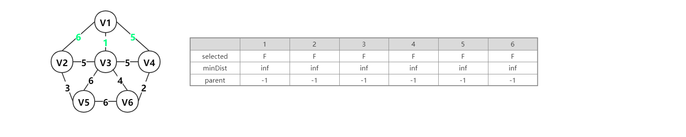

最小生成树：

这个定义有两个约束：最小和树

对于树，从而引出以下三个最小生成树的特点

1. 在图中无环
2. 连接所有图中的点
3. N个顶点，有N-1条边

最小：指的是生成这棵树的边的权值之和最小

最小生成树的求取有两种经典的算法，分别是Prim(普里姆) 算法和Kruskal(克鲁斯卡尔)算法

这两种算法的算法思想都是基于贪心算法的，也就是选择权值最小的边，但是这两种算法的实现方法不同

==**Prim(普里姆)算法**==：从顶点出发，优先选择与连接两个顶点集合中的权值最小的边

==**Kruskal(克鲁斯卡尔)算法**==：直接选择权值最小的边

<br>

#### Prim(普里姆)算法

prim算法的核心是**实时更新**三个列表信息构成的

第一个列表selected，是判断是否已选顶点，若为true，表示顶点已选，若为false，表示顶点未选，初始为false；

第二个列表minDist，表示两个点之间的距离，初始为∞（无穷大）；

第三个列表parent，存放它的双亲结点，初始为-1

1. 整个生成过程是，首先（Update）更新列表信息，从列表下标由小到大更新minDist列表
2. 然后（Scan）扫描整个列表，更新parent列表
3. 最后（Add）将选择的点添加到已选顶点中，也就是更新selected列表

##### 图示过程

如下图

第一个列表selected，是判断是否已选顶点，若为T，表示顶点已选，若为F，表示顶点未选，初始为F；

第二个列表minDist，表示两个点之间的距离，初始为inf（无穷大）；

第三个列表parent，存放它的双亲结点，初始为-1



与V1相连接的点分别是V2，V3，V4，在列表中minDist和列表parent中更新数据，找到minDist最小且selected列表为F的结点，就是连接结点，即下图中为V3


与V1，V3相连接的点分别是V2，V4，V5，V6，在列表中minDist和列表parent中更新数据，找到minDist最小且selected列表为F的结点，就是连接结点，即下图中为V6


与V1，V3，V6相连接的点分别是V2，V4，V5，在列表中minDist和列表parent中更新数据，找到minDist最小且selected列表为F的结点，就是连接结点，即下图中为V4


与V1，V3，V6，V4相连接的点分别是V2，V5，在列表中minDist和列表parent中更新数据，找到minDist最小且selected列表为F的结点，就是连接结点，即下图中为V2


与V1，V3，V6，V4，V2相连接的点分别是V5，在列表中minDist和列表parent中更新数据，找到minDist最小且selected列表为F的结点，就是连接结点，即下图中为V5，是selected列表中的值都为T，生成最小生成树完毕


<br>

Prim算法的时间复杂度 $O(|V|^2)$，不依赖于 $|E|$，因此它适用于求解边稠密的图的最小生成树。

```c++
void Prim(MGraph g, int v) {
    //普利姆算法（参数：邻接矩阵，起点（即第一个生成的点，可随便取））
	int lowcost[MAXV], closest[MAXV], i, min, j, k;
 	//赋初值，即将closest数组都赋为第一个节点v，lowcost数组赋为第一个节点v到各节点的权重
	for (i = 0; i < g.n; i++) {
		closest[i] = v;
		lowcost[i] = g.edges[v][i];
	}
    //接下来找剩下的n-1个节点（g.n是图的节点个数）
	for (i = 1; i < g.n; i++) {
		min = INF;
        //遍历所有节点
		for (j = 0; j < g.n; j++) {
			//若该节点还未被选且权值小于之前遍历所得到的最小值
			if (lowcost[j] != 0 && lowcost[j] < min) { 
                //更新min的值
				min = lowcost[j];
                //记录当前最小权重的节点的编号
				k = j;
			}
		}
        //表明k节点已被选了(作标记)
		lowcost[k] = 0;
        //遍历所有节点
		for (j = 0; j < g.n; j++) {
			if (g.edges[k][j] != 0 && g.edges[k][j] < lowcost[j]) {
				//更新lowcost数组，closest数组
                //更新权重，使其当前最小
				lowcost[j] = g.edges[k][j];
                //进入到该if语句里，说明刚选的节点k与当前节点j有更小的权重，则closest[j]的被连接节点需作修改为k
				closest[j] = k;
			}
		}
	}
}
```


#### Kruskal(克鲁斯卡尔)算法

1. 把图中所有的边和权重放入一个列表，并按权值从小到大排序
2. 从列表中按次序每次选择一条边放入图中（此时逻辑上图中只有顶点没有边）
3. 在放入图中需要做判断，图中是否形成环
4. 若没有环，则这条边成为最小生成树的一条边
5. 相反，如果加上这条边后形成了环，那么这边就被丢弃，继续将下一条边放入图中
6. 重复步骤2到步骤5
7. 直到选择了n-1条边，算法完成


##### 图示过程

存在一张图，它有6个点和10条边，如图a所示，最后完成Kruskal算法后，会有5条边被选定（即挑选完符合条件的5条边）。

图a各边权值如下，现在将边和权重放入一个列表，并按权值从小到大排序。

1. 从列表中按次序选择v1-v3放入图中，该边权重为1，此时图中不存在环，所以V1-V3被选定，且此时边数为1，如图b


2. 从列表中按次序选择v4-v6放入图中，该边权重为2，此时图中不存在环，所以V4-V6被选定，且此时边数为2，如图c
3. 从列表中按次序选择v2-v5放入图中，该边权重为3，此时图中不存在环，所以v2-v5被选定，且此时边数为3，如图d


4. 从列表中按次序选择v3-v6放入图中，该边权重为4，此时图中不存在环，所以v3-v6被选定，且此时边数为4，如图e
5. 从列表中按次序选择v1-v4放入图中，该边权重为5，但此时图中存在环，所以v1-v4不能被选定，且此时边数仍为4，如图f


6. 从列表中按次序选择v3-v4放入图中，该边权重为5，但此时图中存在环，所以v3-v4不能被选定，且此时边数仍为4，如图g
7. 从列表中按次序选择v2-v3放入图中，该边权重为5，此时图中不存在环，所以v2-v3被选定，如图h，且此时边数为5，最小生成树生成完毕


<br>

Kruskal算法的时间复杂度 $O(|E|log|E|)$，因此它适用于求解边稀疏（顶点较多）的图的最小生成树。

```C++
/*
 * @Prama:传进来一个edge和weight列表mapnode，
 * @Prama:一个结点数v
 * @return:nums<map<pair<int,int>,int> >，返回一棵最小生成树
 */
stack<map<pair<int,int>,int> > kruskal(nums<map<pair<int,int>,int> > mapnode, int v){
    // 按weight从小到大排列,也就是map<pair<int,int>,int>中的对应值
	sort_weight(mapnode);
    // 最小生成树的边栈
    stack<map<pair<int,int>,int> > ans; 	
    int edge=0;
    // 边 = 顶点数 - 1;
    while(edge<v){
        ans.push_back(nums[i]);
        edge++;
        // 有环，将插入的边去掉，同时扫描下一条边
        if (isLoop(ans)) {
            ans.pop();
            edge--;
        }
        i++;
    }
}
```

