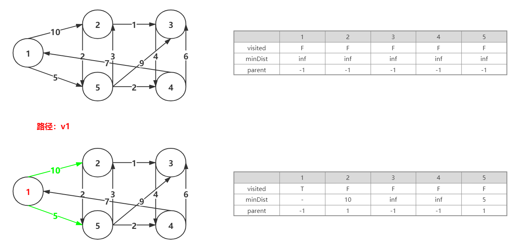
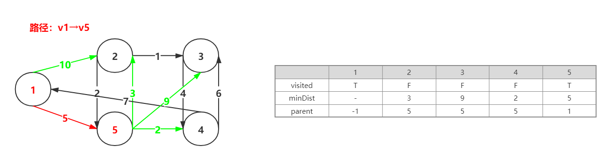
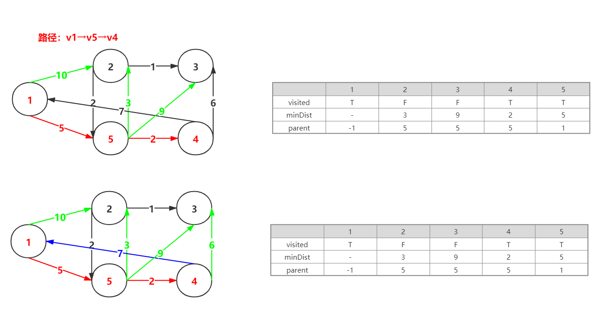
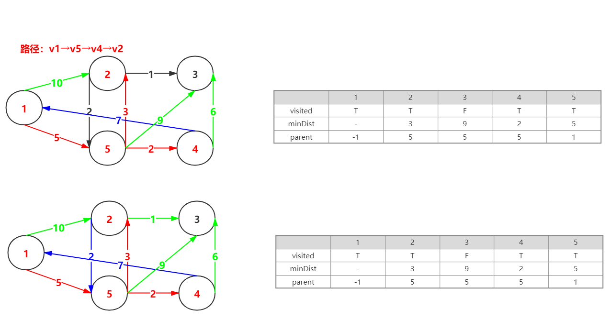
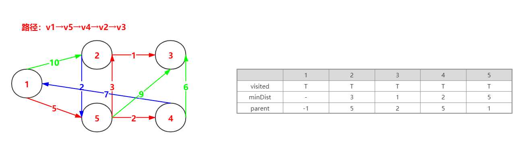
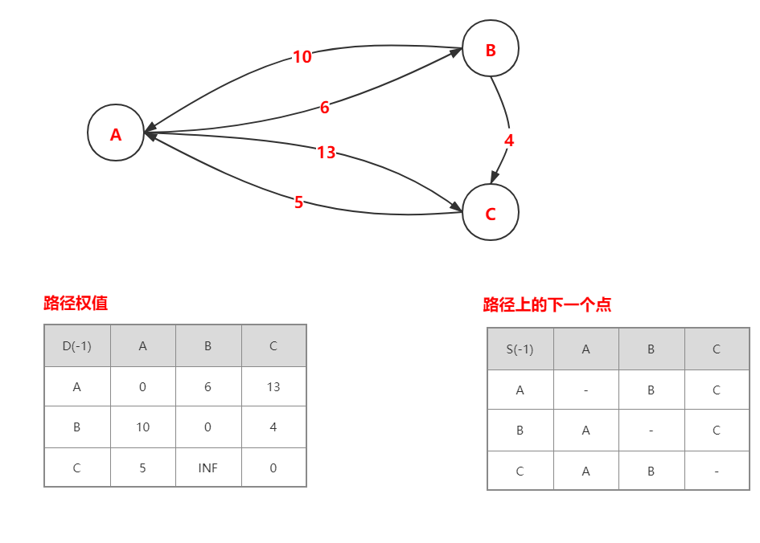
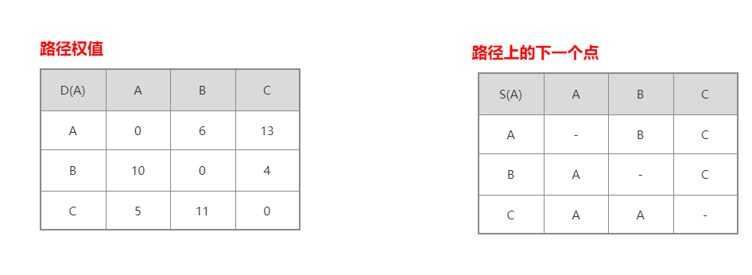
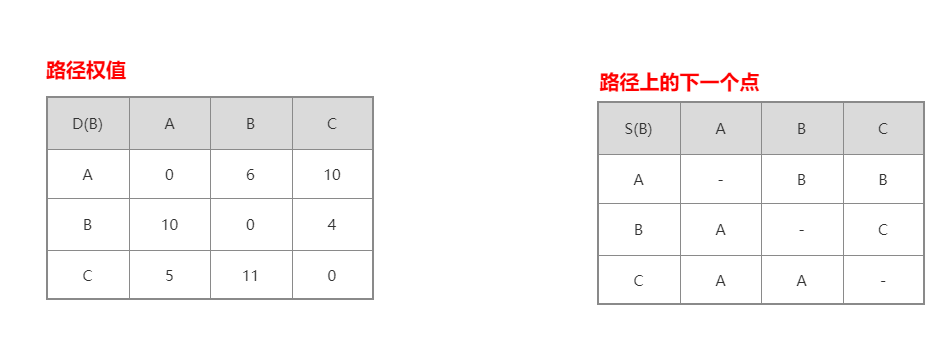
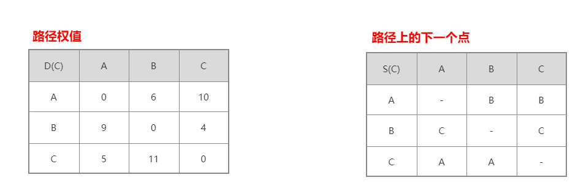

最短路径

最短路径的求取有两种经典的算法，分别是Dijkstra算法和Floyd算法

这Dijkstra算法的算法思想是基于贪心算法的，也就是选择权值最小的边

而Floyd算法的算法思想是根据动态规划，不断迭代取得的

==**Dijkstra算法**==：从顶点出发，优先选择与连接两个顶点集合中的权值最小的边，求单源最短路径

==**Floyd算法**==：求多源最短路径，不断迭代列表中的数据

 

#### Dijkstra

Dijkstra算法的核心是**实时更新**三个列表信息构成的 —— 这与最小生成树中的Prim算法相似

第一个列表visited，是判断是否已选访问过改点，若为true，表示顶点已被访问，若为false，表示顶点未被访问，初始为false；

第二个列表minDist，表示两个点之间的距离，初始为∞（无穷大）；

第三个列表parent，存放它的双亲结点，初始为-1

1. 整个生成过程是，首先（Update）更新列表信息，从列表下标由小到大更新minDist（记录整个路径长度）列表
2. 然后（Scan）扫描整个列表，更新parent列表
3. 最后（Add）将选择的点添加到已选顶点中，也就是更新visited列表

##### 图示过程

有如下图，共有5个顶点，10条边，边的权值如下

首先选择顶点1，更新visited，顶点1的visited的值为T（Add）。

与此同时，与顶点1相连接的顶点分别为顶点2和顶点5，边权分别为10和5。因为10和5均小于inf（Update），所以更新minDist列表中顶点2和顶点5两个部分，同时需要将顶点2和顶点5的parent列表更新为1（Scan）如下图

由于权边5<10，顶点5的列表visited的值为F，所以更新visited，使顶点5的visited的值为T（Add）。

与此同时，与顶点1、顶点5相连接的顶点分别为顶点2、顶点3和顶点4，边权分别为10，3，9，2。因为9和2均小于inf,权值3小于权值10（Update），所以更新minDist列表中顶点2、顶点3和顶点4三个部分，同时需要将顶点2、顶点3和顶点4的parent列表更新为5（Scan）

由于权边在标绿色的权边，2最小，顶点4的列表visited的值为F，所以更新visited，使顶点4的visited的值为T（Add）。

与此同时，与顶点1、顶点5和顶点4相连接的顶点分别为顶点2、顶点3，边权分别为10，3，9，6，7。此时权值最短路径即为当前最短，不需要更新（Update），在最短路径不需要更新的情况下，parent列表也不需要更新（Scan）如下图

由于权边在标绿色的权边，3最小，顶点2的列表visited的值为F，所以更新visited，使顶点2的visited的值为T（Add）。

与此同时，与顶点1、顶点5、顶点4和顶点2相连接的顶点为顶点3，边权分别为10，9，6，1。此时权值最短路径即为当前最短，不需要更新（Update），在最短路径不需要更新的情况下，parent列表也不需要更新（Scan）如下图

由于权边在标绿色的权边，1最小，顶点3的列表visited的值为F，所以更新visited，使顶点3的visited的值为T（Add）。

与此同时，所有顶点相连接，由于权值1<权值9（Update），所以更新minDist列表中顶点3这个部分，同时需要将顶点3的parent列表更新为2（Scan）如下图

#### Floyd

Floyd算法的基本思想是：递推产生两个n阶方阵序列，一个方阵D是： $D^{(-1)}, D^{(A)},D^{(B)},D^{(C)}, \dots,D^{(n)}$，其中 $D^{(n)}[i][j]$ 用以记录从顶点 $v_i$ 到顶点 $v_j$ 的路径长度，n表示操行结点n的运算步骤；另一个方阵S是 $S^{(-1)}, S^{(A)},S^{(B)},S^{(C)}, \dots,S^{(n)}$,其中 $S^{(n)}[i][j]$ 用以记录从顶点 $v_i$ 到顶点 $v_j$ 的路径上的下一个点，n表示操行结点n的运算步骤。

初始情况，若两个顶点之间存在边，在方阵D记录边的权值，若不存在直接联系，就记录为inf；方阵S记录路径上的下一个点，初始状态就是该点本身。

解释：$D^{(A)}[i][j]$ 表示从顶点 $v_i$ 到顶点 $v_j$必经过结点A

存在一个图由3个顶点和5条有向边组成，初始状况下的方阵D和方阵S如下：

由图可知

从A到B，从A到C都可以直接到达；

从B到A可以直接到达，从B到A到C的权值和 $BA+AC=10+13=23$ 大于4，所以不更新；

从C到A可以直接到达，从C到A到，此时权值为 $CA+AB=5+6=11$，因为 $11<inf$，所以更新方阵D横轴为C纵轴为B这个方格中的数据，$inf→11$

与此同时，需要更改方阵S横轴为C纵轴为B这个方格中的数据，B→A

由图可知

从A到B可以直接到达和从A到B到C的权值和为 $AB+BC=6+4=10$ 小于13，所以更新方阵D横轴为A纵轴为C这个方格中的数据，$13→10$ ；

与此同时，需要更改方阵S横轴为A纵轴为C这个方格中的数据，C→B

从B到A，从B到C均可以直接到达，所以不更新；

从C到B到A，此时权值为 $inf+BA=inf$，因为 $5<inf$，所以不更新；从C到B不直达，所以 $11<inf$，所以不更新

由图可知

从A到C到B的权值和为 $AC+CB=13+inf=inf$ 大于于6，所以不需要更新；从A到C可以直接到达，不需要更新

与此同时，需要更改方阵S横轴为A纵轴为C这个方格中的数据，C→B

从B到C到A的权值和为 $BC+CA=4+5=9$ 小于10，需要更改方阵D横轴为B纵轴为	A1个方格中的数据，$10→9$，从B到C均可以直接到达，所以不更新；

与此同时，需要更改方阵S横轴为B纵轴为A这个方格中的数据，A→C

从C到A可以直接到达，不需要更新；从C到B不直达，所以 $11<inf$，所以不更新

