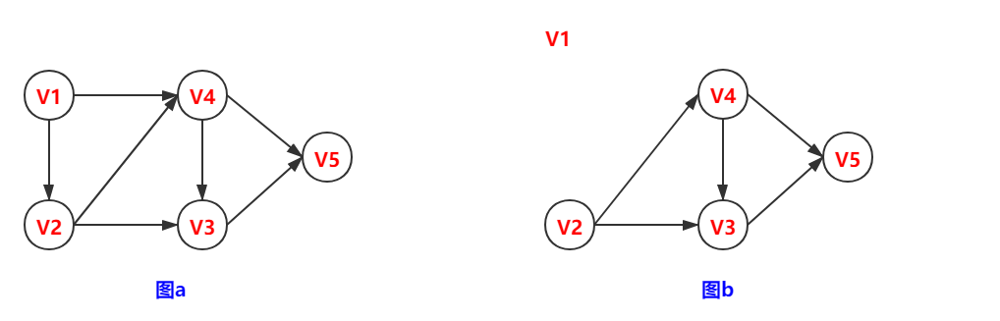
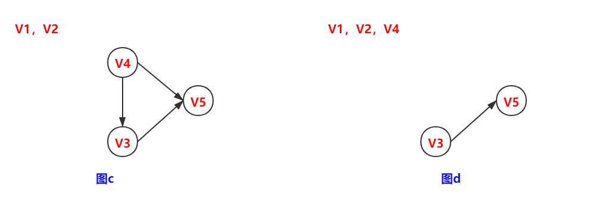
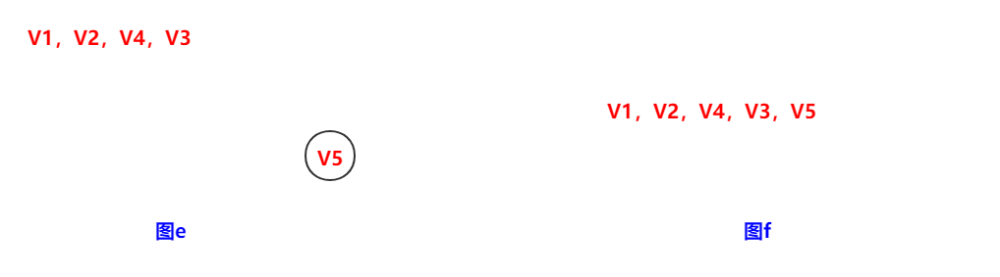
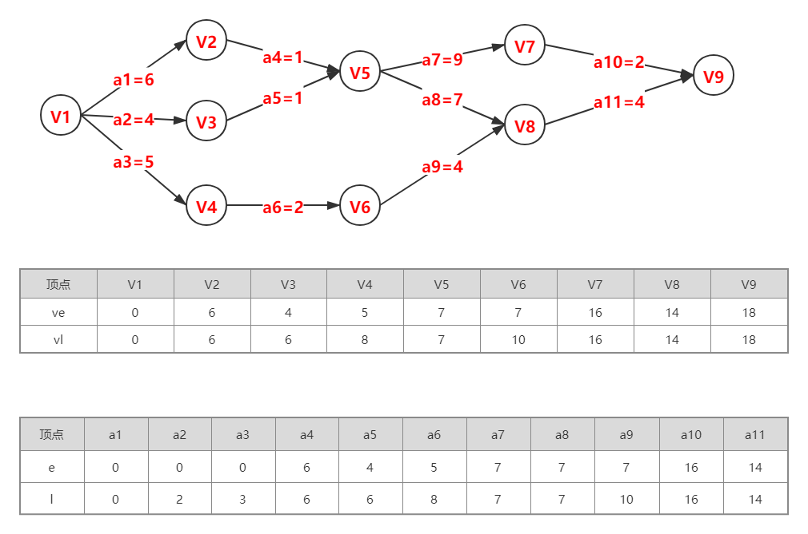

#### 一、拓扑排序

##### 1.1 基本知识

有向无环图：一个有向图中不存在环，简称DAG图

AOV网：用DAG图表示一个工程，其顶点表示活动，用有向边 $<V_i, V_j>$ 表示活动 $V_i$ 必须先于活动 $V_j$ 进行的这样一种关系。

1. 在AOV网中，活动 $V_i$ 是活动 $V_j$ 的先行活动，活动 $V_k$ 是活动 $V_i$ 的先行活动，则活动 $V_k$ 必是活动 $V_j$ 的先行活动，这种先行关系具有传递性

2. AOV网不具有唯一性

##### 1.2 求拓扑排序的基本思想

1. 从有向图中选一个无前驱（入度为0）的顶点输出
2. 将此顶点和以它为起点的弧删除
3. 重复步骤1和步骤2，直到不存在无前驱的顶点
4. 若此时输出的顶点数小于有向图中的顶点数，则说明有向图中存在回路，否则输出的顶点的顺序即为一个拓扑序列。

##### 1.3 图示过程

如图a，V1的入度为0，V2的入度为1，V3的入度为2，V4的入度为2，V5的入度为2，所以将V1取出，如图b

如图b，V2的入度为0，V3的入度为2，V4的入度为1，V5的入度为2，所以将V2取出，如图c

如图c，V3的入度为1，V4的入度为0，V5的入度为2，所以将V4取出，如图d

如图d，V3的入度为0，V5的入度为1，所以将V3取出，如图e

如图e，V5的入度为0，所以将V5取出，如图f

此时没有其他顶点了，整个拓扑排序为：{V1，V2，V4，V3，V5}

##### 1.4 算法思想

1. 求所有顶点的入度，可以附设一个存放各顶点入度的数组indegree[]
2. 把所有入度为0的顶点入队列或栈
3. 当栈或队列不空时
   1. 出栈或出队列顶点为u，输出顶点u
   2. 顶点u的所有邻接点入度减一，如果有入度为O的顶点，则入栈或入队

4. 若此时输出的顶点数小于有向图中的顶点数，则说明有向图中存在回路，否则输出的顶点的顺序即为一个拓扑序列。

#### 二、关键路径

##### 2.1 基本知识

AOE网：在带权有向图图中，以顶点表示事件，以有向边表示活动，以边上的权值表示完成该活动的开销（比如完成活动的时间）

AOE网的性质：

1. 只有在某顶点所代表的事件发生后，从该顶点出发的各有向边所代表的活动才能开始
2. 只有在进入某一顶点的各有向边所代表的活动都已结束时，该顶点所代表的事件才能发生

##### 2.2 求关键路径的基本思想

$ve(V_i)$：**表示事件 $V_i$ 的最早发生时间**

该时间是指从开始顶点 $V$ 到顶点 $V_i$ 的最长路径，事件的最早发生时间决定了所有从 $V_i$ 开始的活动能够开工的最早时间。可用下面的递推公式来计算∶
$$
ve(V_i)=\max\limits_{i} \bigg\{ve(V_i)+w_{i,j}\bigg\}(w_{i,j}表示<V_i,V_j>上的权值)
$$

$vl(V_i)$：**表示事件 $V_i$ 的最晚发生时间**

该时间是指在不推迟整个工程完成的前提下，即保证它所指向的事件 $V_i$ ，即保证它所指向的事件 $V_i$ 在 $ve(V_i)$ 时刻能够发生时，该事件最迟必须发生的时间。可用下面的递推公式来计算∶
$$
ve(V_i)=\min\limits_{j} \bigg\{vl(V_j)-w_{i,j}\bigg\}
$$

$e(V_i)$：**表示事件 $V_i$ 的最早开始时间**

该时间是指该活动的起点所表示的事件最早发生的时间。若边 $<V_i, V_k>$ 表示活动 $a_i$，则有如下公式
$$
e(V_i)=ve(V_j)
$$

$l(V_i)$：**表示事件 $V_i$ 的最晚开始时间**

该时间是指该活动的终点所表示事件的最迟发生时间与该活动所需时间之差。若边 $<V_i,V_j>$ 表示活动 $a_i$，则有如下公式
$$
l(V_i)=vl(V_k)-w_{j,k}
$$

**一个活动 $a_i$ 的最迟开始时间 $l(V_i)$ 和其最早开始时间 $e(V_i)$ 的差额 $d(i)=l(V_i) - e(V_i)$**

它是指该活动完成的时间余量，即在不增加完成整个工程所需总时间的情况下，活动 $a_i$ 可以拖延的时间。若一个活动的时间余量为零，则说明该活动必须要如期完成，否则就会拖延完成整个工程的进度，所以称 $l(V_i) - e(V_i)=0$ 即 $l(V_i)=e(V_i)$ 的活动 $a_i$ 是关键活动。

##### 
2.3 求关键路径的算法步骤

1. 求 AOE 网中所有事件的最早发生时间 $ve(V_i)$
2. 求 AOE 网中所有事件的最迟发生时间 $vl(V_i)$
3. 求 AOE 网中所有活动的最早开始时间 $e(V_i)$ 
4. 求 AOE 网中所有活动的最迟开始时间$l(V_i)$
5. 求 AOE 网中所有活动的差额 $d()$ ，找出所有 $d()=0$ 的活动构成关键路径。


