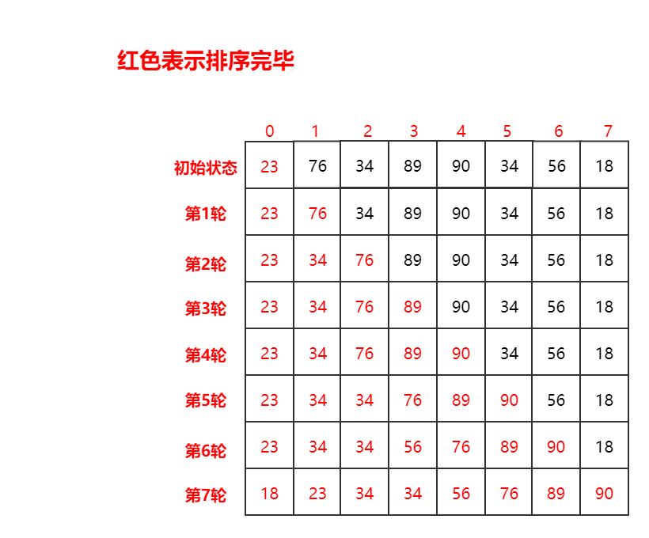
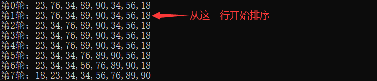
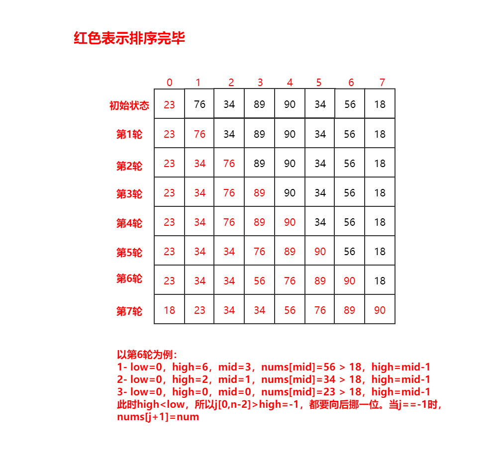
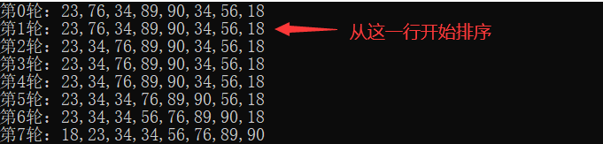
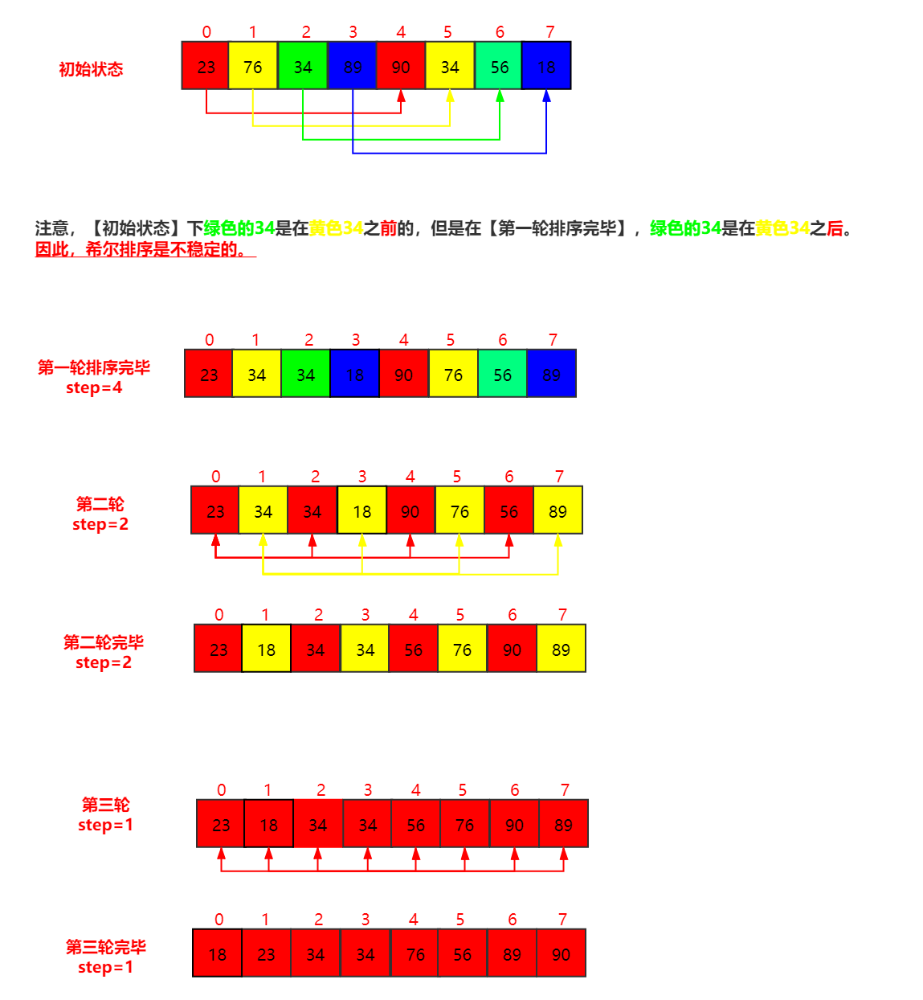
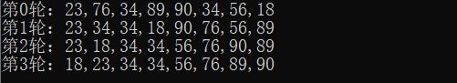

### 直接插入排序(插入排序)

==**排序思想**==

- 对于一个数组 `A[0,n]` 的排序问题，假设认为数组在 `A[0,n-1]` 排序的问题已经解决了。
- 考虑 `A[n]` 的值，从右向左扫描有序数组 `A[0,n-1]` ，直到第一个小于等于 `A[n]` 的元素，将 `A[n]` 插在这个元素的后面。



**==插入排序运用时需要注意的==**

直接插入排序对于**最坏的情况**（严格递减/递增的数组），需要比较和移位的次数为n(n-1)/2；

对于**最好的情况**（严格递增/递减的数组），需要比较的次数是n-1，需要移位的次数是0。

==**插入排序算法分析**==

直接插入排序的时间复杂度是O(n^2^)，空间复杂度是O(1)，同时也是**稳定排序**。

> **稳定排序**：待排序的记录序列中可能存在两个或两个以上关键字相等的记录。排序前的序列中Ri领先于Rj（即i<j）.若在排序后的序列中Ri仍然领先于Rj，则称所用的方法是稳定的。
>
> 比如int数组[1,1,1,6,4]中a[0],a[1],a[2]的值相等，在排序时不改变其序列，则称所用的方法是稳定的。

**==代码实现==**

```c++
class Solution{
public:
	void insertSortion(vector<int> &nums) {
		if(nums.size() < 2) return;
		for(int i = 1; i < nums.size(); i++) {
			int num = nums[i];
			// 防止插入的数是最小的 
			bool flag = false;
			// for循环中，若插入值是最小的，没有给最小的值安排位置 
			for(int j = i - 1; j > -1; j--) {
				if(nums[j] > num) {
					nums[j+1] = nums[j];
				} else {
					nums[j+1] = num;
					flag = true;
					break;
				}
			}
			if(!flag) {
				nums[0] = num; 
			}
		}
		return;
	} 
};
```

==**加工后执行的结果**==




### 折半插入排序(插入排序)

**==排序思想：直接插入排序的改进版==**

1. 有一组数列待排序，排序区间为 `Array[0, n-1]` 。将数列分为有序数列和无序数列，第一次排序时默认 `Array[0]` 为有序数列，`Array[1, n-1]` 为无序数列。有序数列分区的第一个元素位置为 `low` ，最后一个元素的位置为 `high`。
2. 设 Array[0, i-1] 为有序数列，待插入数据为Array[i]。由于Array[0, i-1]有序，使用对有序数列的查找，最好的方法时时间复杂度为O(logn)的折半查找，通过折半查找找到插入位置（即low > high时），将该位置及之后的数据分别往后挪一位



**==折半插入排序运用时需要注意的条件和直接插入排序时需注意的条件一样==**

折半插入排序对于**最坏的情况**（严格递减/递增的数组），需要比较和移位的次数为n(n-1)/2；

对于**最好的情况**（严格递增/递减的数组），需要比较的次数是n-1，需要移位的次数是0。

==但相比直接插入排序==，折半插入排序在**查找位置**的时候得到优化（O(n) → O(logn)）

==**折半排序算法分析**==

折半插入排序的时间复杂度是O(n^2^)，空间复杂度是O(1)，同时也是**稳定排序**。

**==代码实现==**

```c++
#include <stdio.h> 
#include <vector>
using namespace std;
class Solution{
public:
	void binaryInsertionSort(vector<int> &nums) {
		if(nums.size() < 2) return;
		for(int i = 1; i < nums.size(); i++) {
			int low = 0;
			int high = i;
			int num = nums[i];
			while(low <= high) {
				int mid = (low + high) / 2;
				if(nums[mid] > num) {
					high = mid - 1;
				} else {
					low = mid + 1;
				}
			}
			int j;
			for(j = i - 1; j > high; j--) {
				nums[j+1] = nums[j];
			}
			nums[j+1] = num; 
		}
		return; 
	} 
};
```

==**加工后执行的结果**==



### 希尔排序(插入排序)

**==排序思想：通过粗调的方式减少了直接插入排序的工作量==**

对于 `Array[0,n-1]` 这个数列有 `n` 个待排序的数字，取一个小于 `n` 的整数 `step` （`step`被称为步长）将待排序元素分成若干个组子序列，所有距离为 `step` 的倍数的记录放在同一个组中；然后，对各组内的元素进行**直接插入排序**。 这一趟排序完成之后，每一个组的元素都是有序的。然后减小 `step` 的值，并重复执行上述的分组和排序。重复这样的操作，当 `step=1` 时，整个数列就是有序的。



**==希尔排序==**

希尔排序的时间复杂度与增量(即，步长 `step` )的选取有关。例如，当增量 `step` 为1时，希尔排序退化成了直接插入排序，此时的时间复杂度为 `O(n²)`

遇到极端情况，比如 `step=4` 和 `step=2` 时，数组序列不变，进入 `step=1` 时，就是直接插入排序了，相比正常的直接插入排序，还多加了几次 `step=4` 和 `step=2` 的判断

==**插入排序算法分析**==

折半插入排序的时间复杂度是 `O(n^2^)`，空间复杂度是 `O(1)` ，但希尔排序是**不稳定排序**。

**==代码实现==**

```c++
class Solution{
public:
	void ShellSort(vector<int> &nums) {
		int size = nums.size();
		int count = 0;
		for(int step = size / 2; step > 0; step /= 2) {
			for(int i = 0; i < step; i++) {
				insertSort(nums, size, i, step);
			}
		}
	} 
private:
	void insertSort(vector<int> &nums, int size, int i, int step){
		for(int j = i + step; j < size; j+=step) {
			if(nums[j] < nums[j-step]) {
				int num = nums[j];
				int k = j - step;
				while(k >= 0 && nums[k] > num) {
					nums[k+step] = nums[k];
					k -= step;
				}
				nums[k+step] = num;
			}
		}
		return;
	}
};
```


==**加工后执行的结果**==



### 完整测试代码

直接插入排序测试代码

```c++
#include <stdio.h>
#include <vector>
using namespace std;
class Solution{
public:
	void insertSortion(vector<int> &nums) {
		if(nums.size() < 2) return;
		printf("第0轮：");
		for(int i = 0; i < nums.size(); i++) {
			printf("%d",nums[i]);
			if(i!=nums.size()-1) printf(",");
		}
		printf("\n");
		for(int i = 1; i < nums.size(); i++) {
			int num = nums[i];
			// 防止插入的数是最小的 
			bool flag = false;
			// for循环中，若插入值是最小的，没有给最小的值安排位置 
			for(int j = i - 1; j > -1; j--) {
				if(nums[j] > num) {
					nums[j+1] = nums[j];
				} else {
					nums[j+1] = num;
					flag = true;
					break;
				}
			}
			if(!flag) {
				nums[0] = num; 
			}
			// 查看 
			printf("第%d轮：",i);
			for(int i = 0; i < nums.size(); i++) {
				printf("%d",nums[i]);
				if(i!=nums.size()-1) printf(",");
			}
			printf("\n");
		}
		return;
		
	} 
};

int main() {
	vector<int> v;
	v.push_back(23);
	v.push_back(76);
	v.push_back(34);
	v.push_back(89);
	v.push_back(90);
	v.push_back(34);
	v.push_back(56);
	v.push_back(18);
	Solution solution;
	solution.insertSortion(v);
	return 0;
}
```

折半插入排序测试代码

```c++
#include <stdio.h> 
#include <vector>
using namespace std;
class Solution{
public:
	void binaryInsertionSort(vector<int> &nums) {
		if(nums.size() < 2) return;
		printf("第0轮：");
		for(int i = 0; i < nums.size(); i++) {
			printf("%d",nums[i]);
			if(i!=nums.size()-1) printf(",");
		}
		printf("\n");
		for(int i = 1; i < nums.size(); i++) {
			int low = 0;
			int high = i;
			int num = nums[i];
			while(low <= high) {
				int mid = (low + high) / 2;
				if(nums[mid] > num) {
					high = mid - 1;
				} else {
					low = mid + 1;
				}
			}
			int j;
			for(j = i - 1; j > high; j--) {
				nums[j+1] = nums[j];
			}
			nums[j+1] = num; 
			// 查看 
			printf("第%d轮：",i);
			for(int i = 0; i < nums.size(); i++) {
				printf("%d",nums[i]);
				if(i!=nums.size()-1) printf(",");
			}
			printf("\n");
		}
		return; 
	} 
};

int main() {
	vector<int> v;
	v.push_back(23);
	v.push_back(76);
	v.push_back(34);
	v.push_back(89);
	v.push_back(90);
	v.push_back(34);
	v.push_back(56);
	v.push_back(18);
	Solution solution;
	solution.binaryInsertionSort(v);
	return 0;
}
```

希尔排序测试代码

```c++
#include <stdio.h>
#include <vector>
using namespace std;
class Solution{
public:
	void ShellSort(vector<int> &nums) {
		int size = nums.size();
		int count = 0;
		// 查看 
		printf("第0轮：");
		count++;
		for(int i = 0; i < nums.size(); i++) {
			printf("%d",nums[i]);
			if(i!=nums.size()-1) printf(",");
		}
		printf("\n");
		for(int step = size / 2; step > 0; step /= 2) {
			for(int i = 0; i < step; i++) {
				insertSort(nums, size, i, step);
			}
			// 查看 
			printf("第%d轮：",count);
			count++;
			for(int i = 0; i < nums.size(); i++) {
				printf("%d",nums[i]);
				if(i!=nums.size()-1) printf(",");
			}
			printf("\n");
		}
	} 
private:
	void insertSort(vector<int> &nums, int size, int i, int step){
		for(int j = i + step; j < size; j+=step) {
			if(nums[j] < nums[j-step]) {
				int num = nums[j];
				int k = j - step;
				while(k >= 0 && nums[k] > num) {
					nums[k+step] = nums[k];
					k -= step;
				}
				nums[k+step] = num;
			}
		}
		return;
	}
};
int main() {
	vector<int> v;
	v.push_back(23);
	v.push_back(76);
	v.push_back(34);
	v.push_back(89);
	v.push_back(90);
	v.push_back(34);
	v.push_back(56);
	v.push_back(18);
	Solution solution;
	solution.ShellSort(v);
	return 0;
}
```

