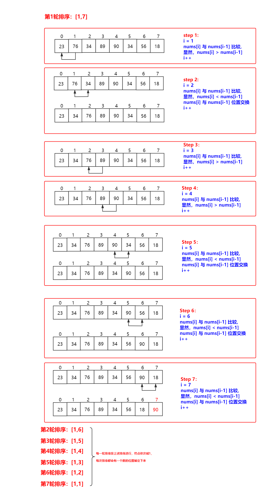
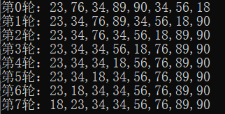
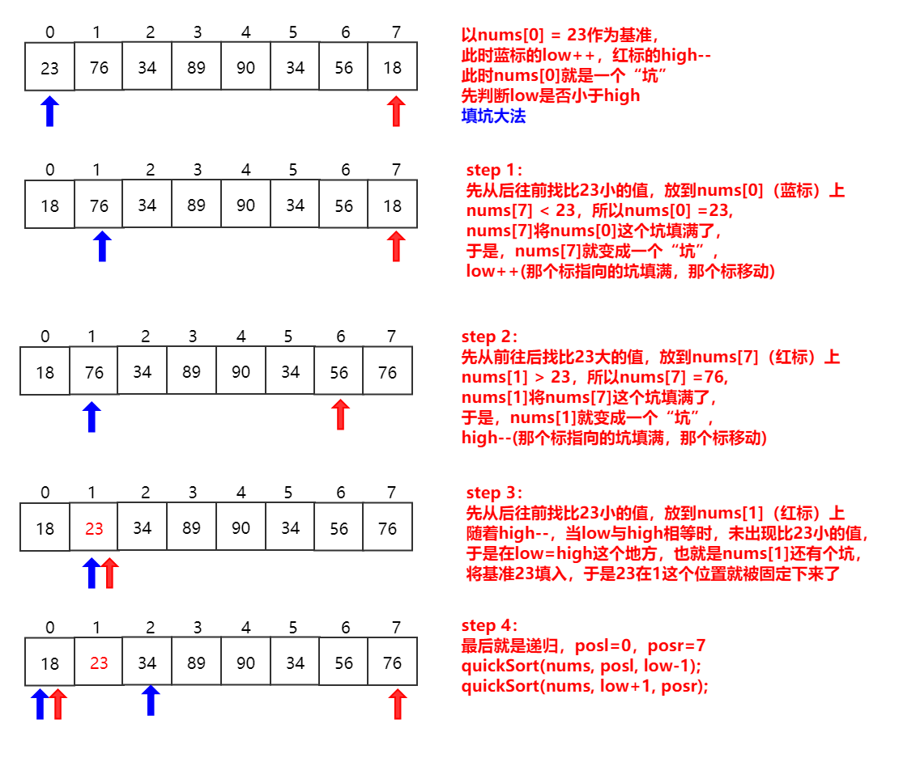
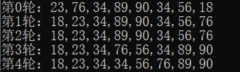

### 冒泡排序(交换排序)

==**排序思想**==

1. 比较相邻的元素。如果第一个比第二个大，就交换他们两个。
2. 对每一对相邻元素做同样的工作，从开始第一对到结尾的最后一对。在这一点，最后的元素应该会是最大的数。
3. 针对所有的元素重复以上的步骤，除了最后一个。
4. 持续每次对越来越少的元素重复上面的步骤，直到没有任何一对数字需要比较。



**==冒泡排序运用时需要注意的==**

冒泡排序对于**最坏的情况**（严格递减/递增的数组），需要比较和移位的次数为 `n(n-1)/2` ；

对于**最好的情况**（严格递增/递减的数组），需要比较的次数是 `n-1` ，需要移位的次数是 `0`。

==**冒泡排序算法分析**==

冒泡排序的时间复杂度是 `O(n^2)` ，空间复杂度是 `O(1)`，同时也是**稳定排序**，**全局有序**（每次排序将会有一个元素放在最终位置上）。

**==代码实现==**

```c++
class Solution{
public:
	void bubbleSort(vector<int> &nums) {
		for(int i = 0; i < nums.size() - 1; i++) {
			for(int j = 1; j < nums.size() - i; j++) {
				if(nums[j] < nums[j-1]) {
					int tmp = nums[j-1];
					nums[j-1] = nums[j];
					nums[j] = tmp;
				}
			}
		}
	}
};
```

==**加工后执行的结果**==



### 快速排序(交换排序)

==**排序思想**==                                                                                                                                                                                                                                                                                                                                                                                                                                                                                                                                                                                                                                                                                                                                                                                                                                

快速排序是一种划分交换排序。它采用了一种分治的策略，通常称其为分治法。

1．先从数列中取出一个数作为基准数。

2．分区过程，将比这个数大的数全放到它的右边，小于或等于它的数全放到它的左边。

3．再对左右区间重复第二步，直到各区间只有一个数。  

虽然快速排序称为分治法，但分治法这三个字显然无法很好的概括快速排序的全部步骤。因此我的对快速排序作了进一步的说明：挖坑填数+分治法



**==快速排序运用时需要注意的==**

快速排序对于**最坏的情况**（严格递减/递增的数组），需要比较和移位的次数为n(n-1)/2；

对于**最好的情况**（严格递增/递减的数组），需要比较的次数是n-1，需要移位的次数是0。

==**快速排序算法分析**==

快速排序最坏的时间复杂度是O(n^2^)，平均时间复杂度为O(nlogn)，空间复杂度最好是O(logn)，最坏是O(n)，

但是快速排序是一种**不稳定排序**，**全局有序**。

**==代码实现==**

```c++
class Solution{
public:
	int counter=0;
	void quickSort(vector<int> &nums, int low, int high) {
		if(low<high) {
			int num = nums[low];
			int posl = low;
			int posr = high;
			while(low < high) {
				//从后往前找比num小的值 
				while(nums[high] >= num && low < high) {
					high--;
				}
				if(low < high){
					nums[low++] = nums[high];
				}
				while(nums[low] <= num && low < high) {
					low++;
				}
				if(low < high){
					nums[high--] = nums[low];
				}
			}
			nums[low] = num;
			quickSort(nums, posl, low-1);
			quickSort(nums, low+1, posr);
		}
	}
};
```

==**加工后执行的结果**==



### 测试代码

冒泡排序测试代码：

```c++
#include <stdio.h>
#include <vector>
using namespace std;

class Solution{
public:
	void bubbleSort(vector<int> &nums) {
				// 查看 
		printf("第0轮：");
		for(int j = 0; j < nums.size(); j++) {
			printf("%d",nums[j]);
			if(j!=nums.size()-1) printf(",");
		}
		printf("\n");
		for(int i = 0; i < nums.size() - 1; i++) {
			for(int j = 1; j < nums.size() - i; j++) {
				if(nums[j] < nums[j-1]) {
					int tmp = nums[j-1];
					nums[j-1] = nums[j];
					nums[j] = tmp;
				}
			}
			// 查看 
			printf("第%d轮：",i+1);
			for(int j = 0; j < nums.size(); j++) {
				printf("%d",nums[j]);
				if(j!=nums.size()-1) printf(",");
			}
			printf("\n");
		}
	}
};

int main() {
	vector<int> v;
	v.push_back(23);
	v.push_back(76);
	v.push_back(34);
	v.push_back(89);
	v.push_back(90);
	v.push_back(34);
	v.push_back(56);
	v.push_back(18);
	Solution solution;
	solution.bubbleSort(v);
	return 0;
}
```

快速排序测试代码

```c++
#include <stdio.h>
#include <vector>
using namespace std;

class Solution{
public:
	int counter=0;
	void quickSort(vector<int> &nums, int low, int high) {
		if(low<high) {
			// 查看 	
			printf("第%d轮：",counter);
			for(int j = 0; j < nums.size(); j++) {
				printf("%d",nums[j]);
				if(j!=nums.size()-1) printf(",");
			}
			printf("\n");
			counter++;
			int num = nums[low];
			int posl = low;
			int posr = high;
			while(low < high) {
				//从后往前找比num小的值 
				while(nums[high] >= num && low < high) {
					high--;
				}
				if(low < high){
					nums[low++] = nums[high];
				}
				while(nums[low] <= num && low < high) {
					low++;
				}
				if(low < high){
					nums[high--] = nums[low];
				}
			}
			nums[low] = num;
			quickSort(nums, posl, low-1);
			quickSort(nums, low+1, posr);
		}
	}
};

int main() {
	vector<int> v;
	v.push_back(23);
	v.push_back(76);
	v.push_back(34);
	v.push_back(89);
	v.push_back(90);
	v.push_back(34);
	v.push_back(56);
	v.push_back(18);
	Solution solution;
	solution.quickSort(v,0,7);
	return 0;
}
```

