### 简单选择排序(选择排序)

==**排序思想**==

1. 首先在未排序序列中找到最小（大）元素，存放到排序序列的起始位置
2. 然后，再从剩余未排序元素中继续寻找最小（大）元素，然后放到已排序序列的末尾。
3. 以此类推，直到所有元素均排序完毕。

下面举个示例：

**第一轮排序**，`i = 0`，`j=1`，`min=23`，`tmp=23`（tmp是用来记录当前需要调整位置的值），`pos = 0`（记录比min小的元素位置）。遍历，当 `j=7` 时，`min=18`，`pos=7`。然后将 `nums[i] = nums[pos]`，`j++`，`pos=i++`

**第二轮排序**，`i =1`，`j=2`，`min=76`，`tmp=76`，`pos = 1`。遍历，当 `j=2` 时，`min=34（黄标）`，`pos=2`。然后将 `nums[i] = nums[pos]`，`j++`，`pos=i`；继续遍历，当 `j=7` 时，`min=23`，`pos=7`。然后将 `nums[i] = nums[pos]`，`j++`，`pos=i++`

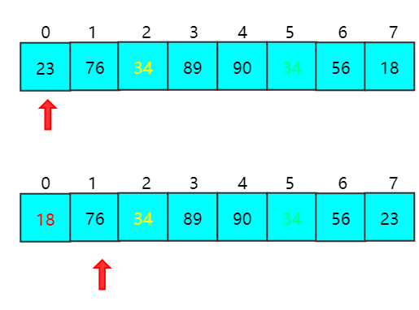

**第三轮排序**，`i =2`，`j=3`，`min=34（黄标）`，`tmp=34（黄标）`，`pos = 2`。遍历，发现没有比 `34（黄标）`更小的元素了。然后将 `j++`，`pos=i++`

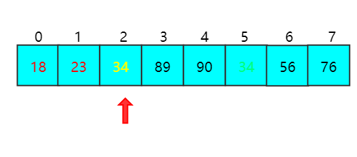

**第四轮排序**，`i =3`，`j=4`，`min=34（绿标）`，`tmp=34（绿标）`，`pos = 3`。遍历，发现没有比 `34（绿标）`更小的元素了，j++，pos=i++

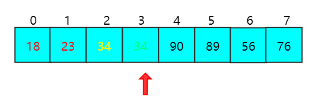

**第五轮排序**，`i =4`，`j=5`，`min=90`，`tmp=90`，`pos = 4`；遍历，当 `j=5` 时，`min=89` ，`pos=5` ；继续遍历，当 `j=6` 时，`min=56`，`pos=6`；然后将 `nums[i] = nums[pos]`，`j++`，`pos=i++`

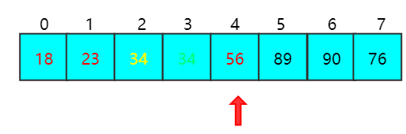

**第六轮排序**，`i =5`，`j=6`，`min=89`，`tmp=89`，`pos = 5`；遍历，当 `j=7` 时，`min=76`，`pos=5`；继续遍历，当 `j=6` 时，`min=56`，`pos=6`；然后将 `nums[i] = nums[pos]`，`j++`，`pos=i++`

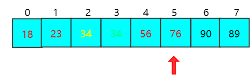

**第六轮排序**，`i =6`，`j=7`，`min=90`，`tmp=90`，`pos = 6`；遍历，当 `j=7` 时，`min=89`，`pos=7`；然后将 `nums[i] = nums[pos]`，`j++`，`pos=i++`

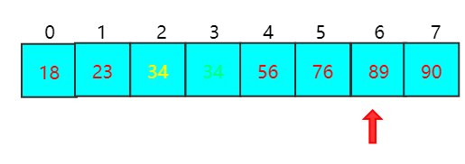

==**简单选择排序算法分析**==

简单选择排序的时间复杂度是 `O(n^2)`，空间复杂度是 `O(1)`，同时也是**不稳定排序**（尝试将18改为34(绿标)初始位置换一下即可知），但是是一种**全局有序**的排序算法。

**==代码实现==**

```c++
class Solution{
public:
	void selectionSort(vector<int> &nums) {
		for(int i = 0; i < nums.size() - 1; i++) {
			int min = nums[i];
			int tmp = nums[i];
			int pos = i;
			for(int j = i+1; j < nums.size(); j++) {
				if(min > nums[j]) {
					min = nums[j];
					pos = j;
				}
			}
			nums[i] = nums[pos];
			nums[pos] = tmp;
		} 
	}
};
```

==**加工后执行的结果**==

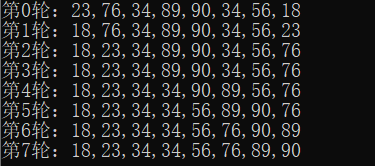

### 堆排序(选择排序)

==**排序思想**==

堆排序是一种属性选择方法，它的特点是：在排序过程中，将nums[0,n-1]视为一棵完全二叉树的顺序结果，之所以采用完全二叉树，是因为完全二叉树与列表下标之间存在数学关系，比如完全二叉树中双亲结点和孩子结点之间的内在关系，在当前无需去中选择关键字最大（最小）的元素

在介绍堆排序之前，首先要介绍一下 `最大堆` 和 `最小堆`，这是堆排序的前置基础。

大顶堆：`nums[i] >= nums[2i+1]` && `nums[i] >= nums[2i+2]` 

大顶堆的文字描述：父结点的值比子结点的值都要大与或等于

小顶堆：`nums[i] <= nums[2i+1]` && `nums[i] <= nums[2i+2]`

小顶堆的文字描述：父结点的值比子结点的值都要小于或等于

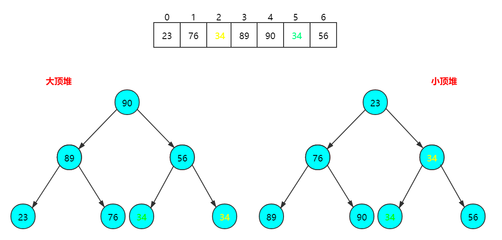

**详解堆排序的过程**，首先是构造最大堆

1. `i = len / 2 - 1`，此时 `i = 2`

2. 令 `k = 2 * i + 1 = 5`（若存在左子结点，得到左子结点，即 `k <= len`）

3. `nums[k] = 34` ，`nums[k++] =56`(若存在兄弟结点)，兄弟结点比较，将指针 `k` 指向较大的结点

4. 将较大的子结点与父结点比较，若子结点大于父结点，就交换位置

5. 调整 `k = 13` 的结点（无）

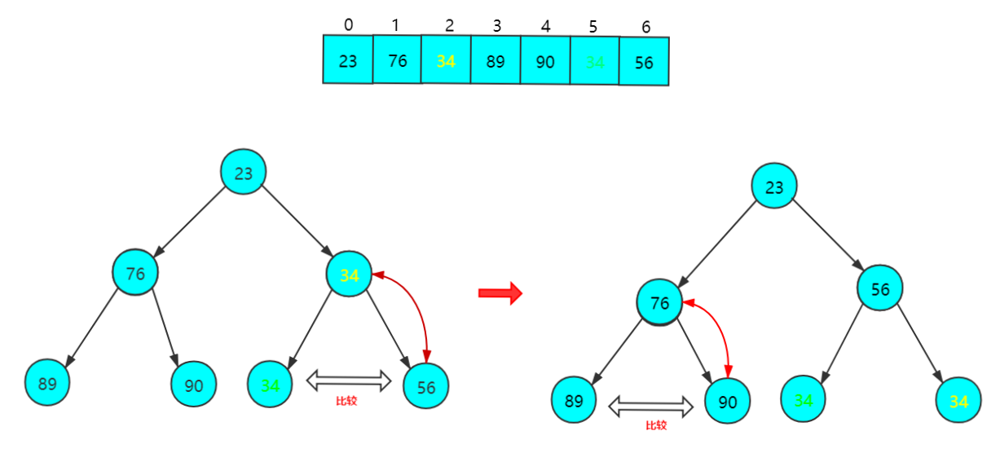

1. `i --`，此时 `i = 1`

2. 令 `k = 2 * i + 1 = 3`（若存在左子结点，得到左子结点）

3. `nums[k] = 89` ，`nums[k++] =90`(若存在兄弟结点，即 `k+1 < len`)，兄弟结点比较，将指针 `k` 指向较大的结点

4. 将较大的子结点与父结点比较，若子结点大于父结点，就交换位置

5. 调整 `k = 9` 的结点（无）

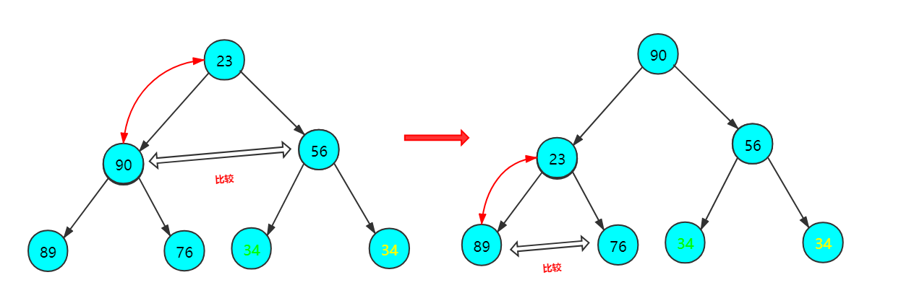

1. `i --`，此时 `i = 0`

2. 令 `k = 2 * i + 1 = 1`（若存在左子结点，得到左子结点）

3. `nums[k] = 90` ，`nums[k++] =56`(若存在兄弟结点，即 `k+1 < len`)，兄弟结点比较，将指针 `k` 指向较大的结点

4. 将较大的子结点与父结点比较，若子结点大于父结点，就交换位置

5. 调整 `k = 3`的结点（无）

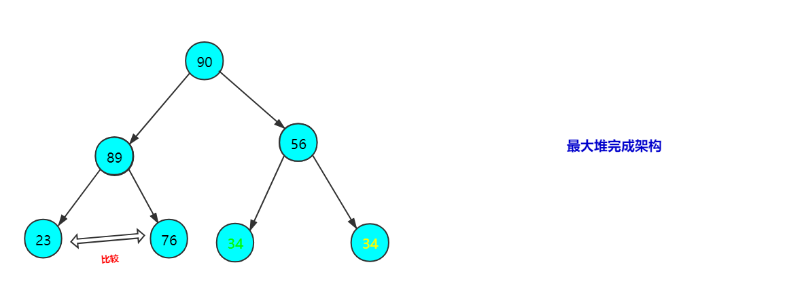

**之后就是堆排序的内容，每一次排序之后，都要重新调整一次堆的结构，使堆称为大顶堆或者小顶堆**


**第一轮调整**：当调整完大顶堆之后，将大顶堆堆顶元素与下标为i的元素交换。也就是说，`i=6` , `nums[6]=90`（堆顶元素）,`nums[0]=34（黄标）`

**第二轮调整**：上一轮调整完毕之后，`i-1`，也就是说 `i=5`，按上面构造大顶堆的方法继续从下往上调整堆的元素，直至完成大顶堆。

当调整完大顶堆之后，将大顶堆堆顶元素与下标为 `i` 的元素交换。也就是说，`i=5`，`nums[5]=89`（堆顶元素）,`nums[0]=34（绿标）`

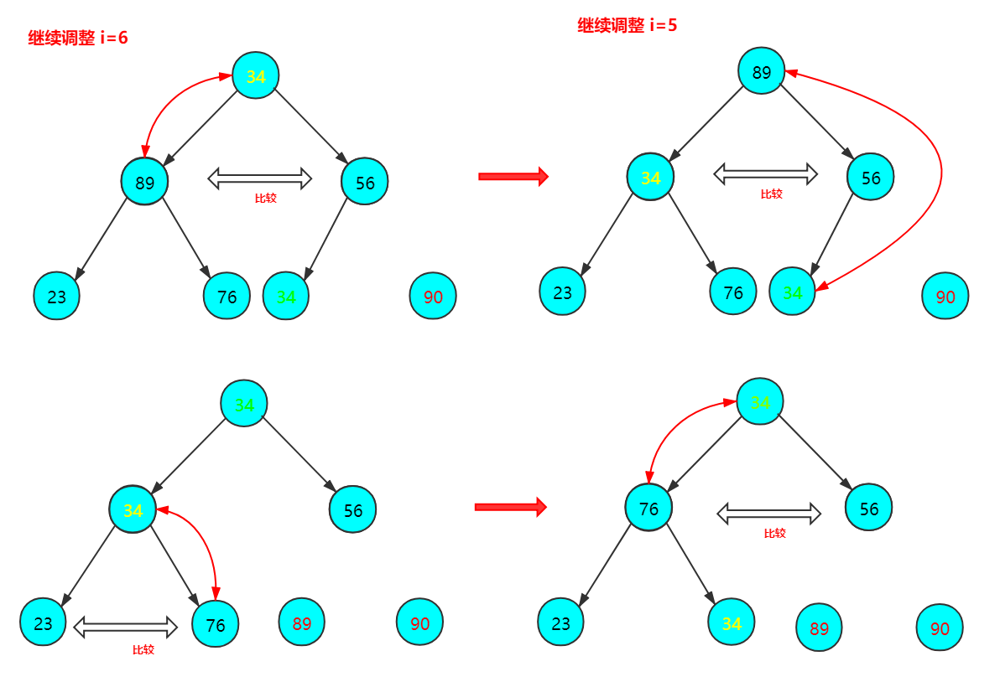

**第三轮调整**：上一轮调整完毕之后，`i-1`，也就是说 `i=4`，按上面构造大顶堆的方法继续从下往上调整堆的元素，直至完成大顶堆。

当调整完大顶堆之后，将大顶堆堆顶元素与下标为i的元素交换。也就是说，`i=4`，`nums[4]=76`（堆顶元素）,`nums[0]=34（黄标）`

**第四轮调整**：上一轮调整完毕之后，`i-1`，也就是说 `i=3`，按上面构造大顶堆的方法继续从下往上调整堆的元素，直至完成大顶堆。

当调整完大顶堆之后，将大顶堆堆顶元素与下标为 `i` 的元素交换。也就是说，`i=3`，`nums[3]=56`（堆顶元素）,`nums[0]=23`

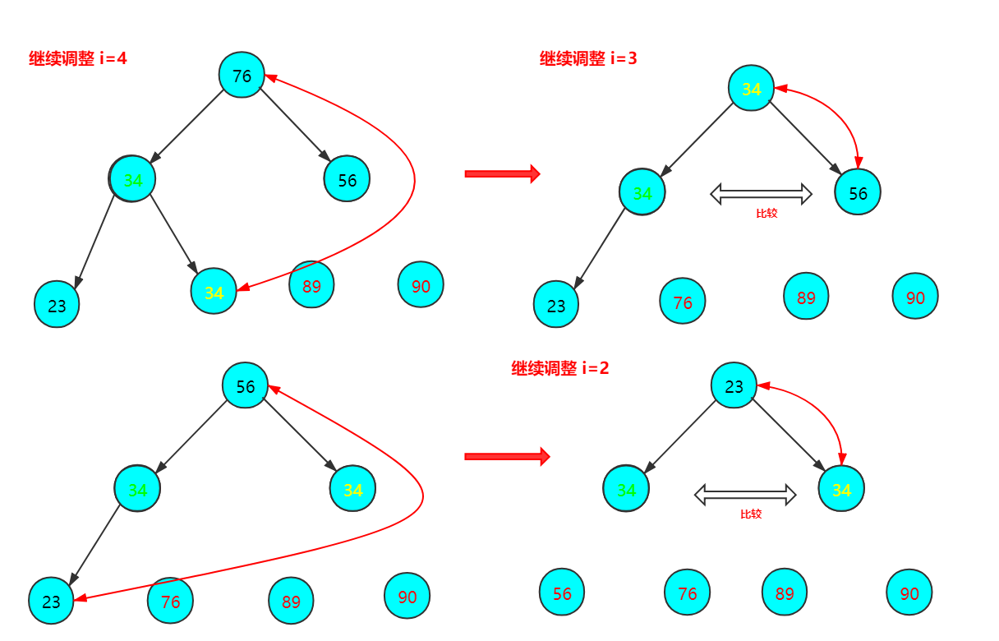

**第五轮调整**：上一轮调整完毕之后，`i-1`，也就是说 `i=2`，按上面构造大顶堆的方法继续从下往上调整堆的元素，直至完成大顶堆。

当调整完大顶堆之后，将大顶堆堆顶元素与下标为i的元素交换。也就是说，`i=2`，`nums[2]=34`（黄标，堆顶元素）,`nums[0]=23`

**最后轮调整**：上一轮调整完毕之后，`i-1`，也就是说 `i=1`，按上面构造大顶堆的方法继续从下往上调整堆的元素，直至完成大顶堆。

当调整完大顶堆之后，将大顶堆堆顶元素与下标为i的元素交换。也就是说，`i=1`，`nums[1]=34`（绿标，堆顶元素）,`nums[0]=23`

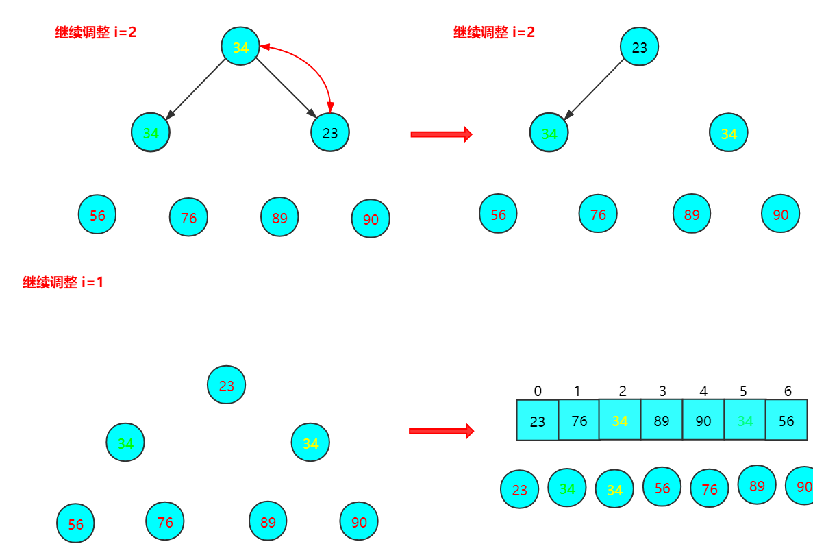

==**了解了样式原理，就可以提炼总结**==

整个堆排序可以分为三个部分

==第一部分，就是堆排序的本体==

1. 首先，对整个列表 `n` 个元素调整为最大堆（对应第二部分，调整堆的元素位置）
2. 其次，自底向上，依次交换元素位置（对应第三部分，交换元素位置）
3. 最后，就是继续对剩余的整个列表个元素调整为最大堆

==第二部分，调整堆的位置==

堆是一颗完全二叉树，也就是说，堆满足完全二叉树的全部性质，比如，父结点是 `nums[i]` 的话，子结点的位置分别是 `nums[2i+1]` 和 `nums[2i+2]`（假设`len > 2i + 2`的话），因此就有如下调整步骤

1. 先取出当前元素 `i`，也就是末尾元素，存为 `temp`
2. 从i结点的左子结点开始，也就是 `k = 2 * i + 1` 处开始
3. 如果左子结点小于右子结点，`k` 指向右子结点，也就是 `k++`
4. 如果子结点大于父结点，将子结点值赋给父结点（不用进行交换），但是要更新i的数值
5. 继续到较大结点的左右结点（若存在），调整相应位置，即每一次为 `2 * k + 1`
6. 调整的最后就是将更新后i的位置就是temp的位置

==第三部分，交换元素位置==

在调整为大顶堆之后

1. 传入列表指针，栈顶也就是 `0`，和最后一个数字，也就是 `i`
2. 将堆顶元素和最后一个元素交换

**==堆要注意的==**

堆排序排序对于**最坏的情况**（严格递减/递增的数组），需要比较和移位的次数为 `n(n-1)/2`；

对于**最好的情况**（严格递增/递减的数组），需要比较的次数是 `n-1`，需要移位的次数是 `0`。

==**堆序算法分析**==

堆排序的时间复杂度是 `O(nlogn)`，空间复杂度是 `O(1)`，但是通过前面示例中34和黄标和绿标的相对位置可以得知，堆排序是 **不稳定排序**，但它是 **全局有序**。

**==代码实现==**

```c++
class Solution{
public:
	void heapSort(vector<int> &nums) {
		// 1.构造大顶堆
		for(int i = nums.size() / 2 - 1; i >= 0; i--) {
			//从第一个非叶子结点从下至上，从右至左调整结构
			adjustHeap(nums,i,nums.size());
		} 
		//2.调整堆结构+交换堆顶元素与末尾元素
        for(int i = nums.size() - 1; i > 0; i--){
        	//将堆顶元素与末尾元素进行交换
            swap(nums, 0, i);
            //重新对堆进行调整
            adjustHeap(nums, 0, i);
        }
	}
private:
	//调整大顶堆（仅是调整过程，建立在大顶堆已构建的基础上）
    void adjustHeap(vector<int> &nums, int i, int len) {
     	// 先取出当前元素i
     	int temp = nums[i];
     	// 从i结点的左子结点开始，也就是2i+1处开始
        for(int k = 2 * i + 1; k < len; k = 2 * k + 1) {
        	// 如果左子结点小于右子结点，k指向右子结点
            if(k + 1 < len && nums[k]<nums[k+1]){
                k++;
            }
            //如果子结点大于父结点，将子结点值赋给父结点（不用进行交换）
            if(nums[k] > temp){
                nums[i] = nums[k];
                i = k;
            }else{
                break;
            }
        }
        //将temp值放到最终的位置
        nums[i] = temp;
	 }
	// 交换元素
    void swap(vector<int> &nums, int a ,int b){
        int temp=nums[a];
        nums[a] = nums[b];
        nums[b] = temp;
    }
};
```

==**加工后执行的结果**==

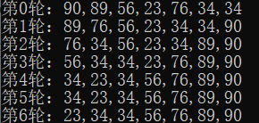

简单选择排序测试代码

```c++
#include <stdio.h>
#include <vector>
using namespace std;

class Solution{
public:
	void selectionSort(vector<int> &nums) {
		printf("第0轮：");
		for(int j = 0; j < nums.size(); j++) {
			printf("%d",nums[j]);
			if(j!=nums.size()-1) printf(",");
		}
		printf("\n");
		for(int i = 0; i < nums.size() - 1; i++) {
			int min = nums[i];
			int tmp = nums[i];
			int pos = i;
			for(int j = i+1; j < nums.size(); j++) {
				if(min > nums[j]) {
					min = nums[j];
					pos = j;
				}
			}
			nums[i] = nums[pos];
			nums[pos] = tmp;
			printf("第%d轮：", i+1);
			for(int j = 0; j < nums.size(); j++) {
				printf("%d",nums[j]);
				if(j!=nums.size()-1) printf(",");
			}
			printf("\n");
		} 
	}
};

int main() {
	vector<int> v;
	v.push_back(23);
	v.push_back(76);
	v.push_back(34);
	v.push_back(89);
	v.push_back(90);
	v.push_back(34);
	v.push_back(56);
	v.push_back(18);
	Solution solution;
	solution.selectionSort(v);
	return 0;
}
```

堆排序测试代码

```c++
#include <stdio.h>
#include <vector>
using namespace std;

class Solution{
public:
	void heapSort(vector<int> &nums) {
		// 1.构造大顶堆
		for(int i = nums.size() / 2 - 1; i >= 0; i--) {
			//从第一个非叶子结点从下至上，从右至左调整结构
			adjustHeap(nums,i,nums.size());
		} 
		int counter = 0;
		//2.调整堆结构+交换堆顶元素与末尾元素
        for(int i = nums.size() - 1; i > 0; i--){
        	printf("第%d轮：", counter++);
			for(int j = 0; j < nums.size(); j++) {
				printf("%d",nums[j]);
				if(j!=nums.size()-1) printf(",");
			}
			printf("\n");
        	//将堆顶元素与末尾元素进行交换
            swap(nums, 0, i);
            //重新对堆进行调整
            adjustHeap(nums, 0, i);
        }
        printf("第%d轮：", counter++);
			for(int j = 0; j < nums.size(); j++) {
				printf("%d",nums[j]);
				if(j!=nums.size()-1) printf(",");
			}
		printf("\n");
	}
private:
	//调整大顶堆（仅是调整过程，建立在大顶堆已构建的基础上）
    void adjustHeap(vector<int> &nums, int i, int len) {
     	//先取出当前元素i
     	int temp = nums[i];
     	//从i结点的左子结点开始，也就是2i+1处开始
        for(int k = 2 * i + 1; k < len; k = 2 * k + 1) {
        	//如果左子结点小于右子结点，k指向右子结点
            if(k + 1 < len && nums[k]<nums[k+1]){
                k++;
            }
            //如果子结点大于父结点，将子结点值赋给父结点（不用进行交换）
            if(nums[k] > temp){
                nums[i] = nums[k];
                i = k;
            }else{
                break;
            }
        }
        //将temp值放到最终的位置
        nums[i] = temp;
	 }
	// 交换元素
    void swap(vector<int> &nums, int a ,int b){
        int temp=nums[a];
        nums[a] = nums[b];
        nums[b] = temp;
    }
};

int main() {
	vector<int> v;
	v.push_back(23);
	v.push_back(76);
	v.push_back(34);
	v.push_back(89);
	v.push_back(90);
	v.push_back(34);
	v.push_back(56);
	Solution solution;
	solution.heapSort(v);
	return 0;
}
```

