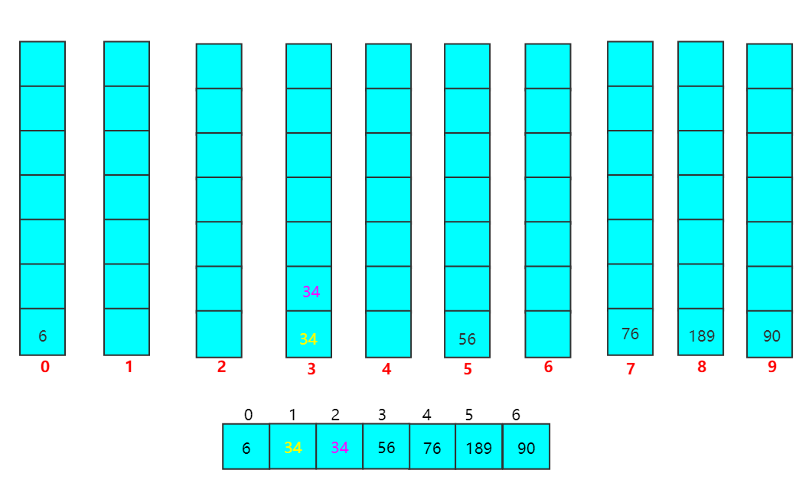

### 归并排序

==**排序思想**==

归并排序就是将两个或两个以上的有序表组合成一个新的有序表

从代码结构来看，**归并排序**类似**树的后序遍历** —— （参考**快速排序**，类似**树的先序遍历**）


==**归并排序算法分析**==

归并排序的时间复杂度是 `O(nlogn)`，由于我采用的方式是下标元素的交换，所以没有用到辅助空间，因此空间复杂度是 `O(1)`，同时也是 **稳定排序**， 由于它是一种分治思想，所以它的元素 **不是全局有序** 的。

**==代码实现==**

```c++
class Solution{
public:
	int counter = 0;
	int ans[7] = {23,76,34, 89, 90,34,56};
	void mergeSort(int low, int high) {
		if(low>=high) return;
		int mid = (low + high) / 2;
		mergeSort(low,mid);
		mergeSort(mid+1,high);
		mergeTwoList(low,mid,high);
		return;
	}
private:
	void mergeTwoList(int low, int mid, int high) {
		int i = low;
		int j = mid+1;
		int tmp[10] = {0};
		int flag = low;
		while(i<=mid&&j<=high) {
			if(ans[i]<ans[j]) {
				tmp[flag++] = ans[i++];
			} else {
				tmp[flag++] = ans[j++];
			}
		}
		while(i<=mid) tmp[flag++] = ans[i++];
		while(j<=high) tmp[flag++] = ans[j++];
		for(int k = low; k <= high; k++) {
			ans[k]=tmp[k];
		}
		
		return;
	}
};
```

==**加工后执行的结果**==

<br>


<br>

### 基数排序

==**排序思想**==

基数排序不基于比较进行排序，而是采用多关键字的排序思想。也就是说基数排序实际上是关于关键字各位的的大小排序的。

**通过示例解释一下**

以下 `nums[0,6]` 的个位数依次为 `{6, 6, 4, 9, 0, 4, 6}` ，按这个依据从小到大排序，`{90, 34, 34, 6, 76, 56, 189}`


以上 `nums[0,6]` 的十位数依次为 `{9, 3, 3, 0, 7, 5, 8}`，按这个依据从小到大排序，`{6, 34, 34, 56, 76, 189, 90}`



以上 `nums[0,6]` 的百位数依次为 `{0, 0, 0, 0, 0, 1, 0}`，按这个依据从小到大排序，`{6, 34, 34, 56, 76, 90, 189}`


==**基数排序算法分析**==

基数排序的时间复杂度是 `O(dn)`，也就是需要精心 `d` 趟分配，一趟分配和收集需要 `O(n)`，空间复杂度是 `O(10n)`，同时也是 **稳定排序**， 但 **不是全局有序** 的。

**==代码实现==**

```c++
class Solution{
public:
	void radixSort(vector<int> nums) {
		vector<vector<int> > tmp;
		vector<int> list;
		int anchor = 1;
		int counter = 0;
        // lgchor + 1趟排序
		while(anchor) {
			tmp.clear();
            // 需要辅助数列
			for(int j = 0; j < 10; j++) {
				list.clear();
				list.push_back(j);
				tmp.push_back(list);
			}
			int i = 0; 
			// 按关键字各个位数排序
			while(i<7) {
				int rest = nums[i] % (anchor * 10);
				int radix = rest / anchor;
				tmp[radix].push_back(nums[i++]);
			}
			// 放在一个列表中
			nums.clear();
			for(int j = 0; j < 10; j++) {
				for(int k = 1; k < tmp[j].size(); k++) {
					nums.push_back(tmp[j][k]);
				}
				if(tmp[j].size()==7) anchor=0;
			} 
			anchor *= 10;
		}
		return;
	}
};
```


==**加工后执行的结果**==

<br>


<br>

归并排序测试代码

```c++
#include <stdio.h>
#include <vector>
using namespace std;

class Solution{
public:
	int counter = 0;
	int ans[7] = {23,76,34, 89, 90,34,56};
	void mergeSort(int low, int high) {
		if(low>=high) return;
		int mid = (low + high) / 2;
		mergeSort(low,mid);
		mergeSort(mid+1,high);
		mergeTwoList(low,mid,high);
		printf("第%d轮：", counter++);
		for(int j = 0; j < 7; j++) {
			printf(" %d ",ans[j]);
			if(j!=6) printf(",");
		}
		printf("\n");
		return;
	}
private:
	void mergeTwoList(int low, int mid, int high) {
		int i = low;
		int j = mid+1;
		int tmp[10] = {0};
		int flag = low;
		while(i<=mid&&j<=high) {
			if(ans[i]<ans[j]) {
				tmp[flag++] = ans[i++];
			} else {
				tmp[flag++] = ans[j++];
			}
		}
		while(i<=mid) tmp[flag++] = ans[i++];
		while(j<=high) tmp[flag++] = ans[j++];
		for(int k = low; k <= high; k++) {
			ans[k]=tmp[k];
		}
		
		return;
	}
};

int main() {
	Solution solution;
	solution.mergeSort(0,6);
	return 0;
} 
```

基数排序测试代码

```c++
#include <stdio.h>
#include <vector>
using namespace std;

class Solution{
public:
	void radixSort(vector<int> nums) {
		vector<vector<int> > tmp;
		vector<int> list;
		int anchor = 1;
		int counter = 0;
		while(anchor) {
			tmp.clear();
			for(int j = 0; j < 10; j++) {
				list.clear();
				list.push_back(j);
				tmp.push_back(list);
			}
			int i = 0; 
			// 第一轮排序
			while(i<7) {
				int rest = nums[i] % (anchor * 10);
				int radix = rest / anchor;
				tmp[radix].push_back(nums[i++]);
			}
			// 放在一个列表中
			nums.clear();
			for(int j = 0; j < 10; j++) {
				for(int k = 1; k < tmp[j].size(); k++) {
					nums.push_back(tmp[j][k]);
				}
				if(tmp[j].size()==7) anchor=0;
			} 
			anchor *= 10;
			printf("第%d轮：", counter++);
			for(int j = 0; j < nums.size(); j++) {
				printf("%d",nums[j]);
				if(j!=nums.size()-1) printf(",");
			}
			printf("\n");
		}
		return;
	}
};

int main() {
	vector<int> v;
	v.push_back(6);
	v.push_back(76);
	v.push_back(34);
	v.push_back(189);
	v.push_back(90);
	v.push_back(34);
	v.push_back(56);
	Solution solution;
	solution.radixSort(v);
	return 0;
}
```

