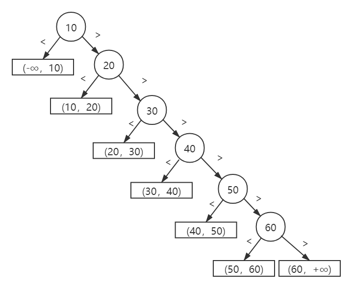
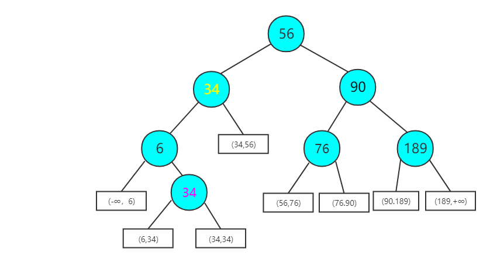
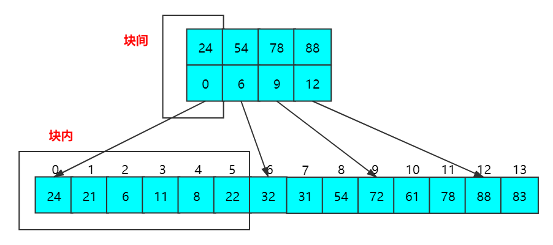

平均查找长度是所有查找过程中进行关键字的比较次数的平均值

失败的平均查找长度：图画出来，补充为二叉树，其中补上的层数之和是分子，列表长度len+1是分母

### 顺序查找

**顺序查找**主要是用于线性表中的查找。在查找中，待查找数列有 **无序数列** 和 **有序数列** 两种

```c++
class Solution{
public:
	bool unorderSearch(Node* head, int value) {
		while(head) {
            if(head->val == value) {
                return true;
            }
            head = head->next;
        }
        return false;
	} 
};
```

平均成功查找长度：==ASL~成功~ = $\frac{n+1}{2}$==

解释：如果第一个点找到，就是1；如果第二个点找到，就是2；依次类推，第n个点找到，就是n；一共有n种可能，所以 ASL~成功~ = $\frac{1+2+3+……+n}{n}$ = $\frac{n(n+1)}{2n}$ = $\frac{n+1}{2}$

无序列表 · 顺序查找平均失败查找长度：==ASL~失败~ = $n+1$==

解释：就是在前n个找不到，继续探索下一个（但下一个是null），因此在n的基础上还要加1，所以为 ASL~失败~ = $ n+1$

有序列表 · 顺序查找平均失败查找长度：==ASL~失败~ = $\frac{n}{2} + \frac{n}{n+1}$==

解释：从以下图示中可以知道，在相等查找概率 的情况下，到达某个点查找失败概率为 $\frac{1}{n+1}$ （有n+1个区间）。而分子则是节点所在层次，亦从下图矩形位置可以得到，也就是 $1+2+……+n+n$ 。综上所述



顺序查找的特点：好处是对数据元素的存储没有要求，顺序存储或者链式存储都可以；缺点是当n较大时，平均查找长度较大，效率低。

### 折半查找

仅适用于 **有序** 的 **顺序表** 。它的基本思想是：首先将给定值key与表中中间位置的关键字比较，若相等，则查找成功；若不相等，在搜小范围之后继续进行同样查找，如此重复。

```c++
bool bisearch(vector<int> &nums, int value) {
    int start = 0;
    int end = nums.size();
    while(start <= end) {
        int mid = (start + end) / 2;
        if(nums[i]==value) {
            return true;
        } else if (nums[i] < value) {
            start = mid + 1;
        } else {
            end = mid - 1;
        }
    }
    return false;
}
```

平均成功查找长度：==ASL~成功~ = $\frac{(层数)*(同层节点个数)}{n}$==

平均失败查找长度：==ASL~失败~ = $\frac{(层数)*(同层与该节点子节点情况类似个数)}{n+1}$==

以如下图示：



平均成功查找长度：ASL~成功~ = $\frac{1*1+2*2+3*3+4*1}{7}$= $\frac{18}{7}$

平均失败查找长度：ASL~失败~ = $\frac{2*1+3*5+4*2}{8}$= $\frac{25}{8}$

### 分块查找

基本思想：将查找表分为若干子块。块内的元素可以无序，但块与块之间是有序的，第一个块中最大关键字小于第二个块中的所记录的所有关键字，同理，第二个块中最大关键字小于第三个块中的所记录的所有关键字，依次类推。



分块查找的平均查找长度为索引查找和块内查找的平均长度之和。设索引查找和块内查找的平均查找长度分别为L1，L2，那么分块查找的平均查找长度为 ==$ALS = L1 + L2$==

将长度为n的查找表均匀分为b块，每块有s个记录，在等概率情况下，平均查找长度为 ==$ALS = ALS_块间 +ALS_块内= L1 + L2 = \frac{b+1}{2} + \frac{s+1}{2} = \frac{s^2 + 2s + n}{2s}$==

此时，若s=$\sqrt n$ ，则平均查找长度取最小值$\sqrt n +1$；若对索引表采用折半查找时，则平均长度为==$ALS = ALS_折 +ALS_顺= L1 + L2 = log_2(b+1) + \frac{s + 1}{2}$==

