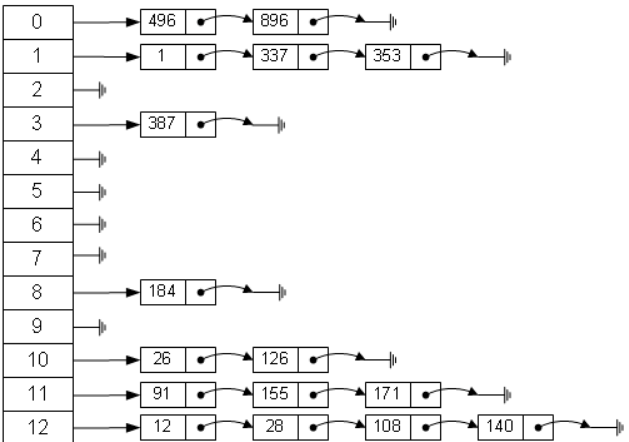

### 散列表的一些基本概念

**散列表**（Hash table，也叫哈希表），是根据关键码值(Key value)而直接进行访问的数据结构。**也就是说**，==它通过把关键码值映射到表中一个位置来访问记录，以加快查找的速度。== 

计算映射位置的函数叫做 **散列函数**。

存放记录的数组叫做 **散列表**。

散列函数可能会把两个或两个以上的不同关键字映射到同一个散列表中的位置，这种情况叫做 **冲突**。

一些散列函数计算的key值会使得大量元素出现在相邻的散列地址上，从而大大降低了查找效率，这种现象叫做 **“聚集”（或堆积）**

**装填因子**，定义为一个表的装满程度，公式为
$$
α = \frac{表中的记录数n}{散列表长度m}
$$
散列表的平均查找长度依赖于散列表的装填因子 α，而不直接依赖于 n 或 m。装填因子有这样的性质，==直观地看，α越大，表示装填的记录约 “满”，发生 **冲突** 的可能性**越大**，反之发生 **冲突** 的可能性 **越小**。==

<br>

### 散列函数的构造方法

设计散列函数的几个原则

1. 函数的定义域必须包含全部关键字
2. 计算出来的key应该是等概率、均匀的
3. 尽量简单

**1. 直接定址法**
$$
H(key) = a * key + b   (a,b∈R)
$$
特点：简单不会产生冲突

适用：是和关键字的分布基本连续

缺点：若关键字分布不连续，会造成较多空位，从而浪费存储空间

例如：

有表一数据如下，经过 **直接定址法** 处理后的hash表如表二所示

表一

| 地址 | A1   | A2   | ……   | A99  | A100 |
| ---- | ---- | ---- | ---- | ---- | ---- |
| 年龄 | 1    | 2    | ……   | 99   | 100  |
| 人数 | 980  | 800  | ……   | 495  | 107  |

表二

| 地址 | A0   | A1   | ……   | A99  | A100 |
| ---- | ---- | ---- | ---- | ---- | ---- |
| 年龄 | 1980 | 1981 | ……   | 1999 | 2000 |
| 人数 | 980  | 800  | ……   | 495  | 107  |

**2. 除留余数法**
$$
H(key) = key  \%  p  (p≤m)
$$
特点：p是一个不大于散列表长度m且最接近或等于散列表长度的质数

适用：使得每个关键字通过该函数转换后等概况地映射到散列空间上的任一地址，从而降低冲突

例如：

已知待散列元素为（*18*，*75*，*60*，*43*，*54*，*90*，*46*），表长*m=10*，*p=7*，则有

| h(18)=18 % 7=4 | h(75)=75 % 7=5 |  h(60)=60 % 7=4  | h(43)=43 % 7=1 |
| :------------: | :------------: | :--------------: | :------------: |
| h(54)=54 % 7=5 | h(90)=90 % 7=6 | *h(46)=46 % 7=4* |                |


**3. 数字分析法**

特点：关键字在某些位上分布不均匀，只有某几种数码经常出现，此时应选取数码分布较为均匀的若干位作为散列地址

适用：能预先估计出全体关键字的每一位上各种数字出现的频度。若更换了关键字，则需要重新构造新的散列函数

例如：

|          K1          |          K2          |          K3          |          K4          |          K5          |          K6          |          K7          |          K8          |
| :------------------: | :------------------: | :------------------: | :------------------: | :------------------: | :------------------: | :------------------: | :------------------: |
| ==613==17==6==**02** | ==613==26==8==**75** | ==627==39==6==**28** | ==613==43==6==**34** | ==627==06==8==**15** | ==627==74==6==**38** | ==613==81==2==**62** | ==613==94==2==**20** |

上述8个关键字可知，关键字从左到右的第1（6）、2（1）、3（3）、6（2）位取值比较集中，不宜作为哈希地址。剩余的第4、5、7、8位取值较均匀，可选取其中的两位作为哈希地址。设选取最后两位作为哈希地址，则这8个关键字的哈希地址分别为：2，75，28，34，15，38，62，20。   

**4. 平方取中法**

特点：取关键字平方后的中间几位为哈希地址。

适用：关键字中的每一位都有某些数字重复出现频度很高的现象，这种散列地址分布比较均匀

例如：

若设哈希表长为1000则可取关键字平方值的中间三位，如图所示：

| 关键字 | 关键字的平方 | 哈希函数值 |
| ------ | ------------ | ---------- |
| 1234   | 15==227==56  | 227        |
| 2143   | 45==924==49  | 924        |
| 4132   | 170==734==24 | 734        |
| 3214   | 103==297==96 | 297        |

**5. 折叠法**

特点：将关键字分割成位数相同的几部分，然后取这几部分的叠加和作为散列地址

适用：关键字的数字位数特别多

例如：

当哈希表长为1000时，关键字key=110108331119891，允许的地址空间为三位十进制数，则这两种叠加情况如图：

|      |  移位叠加 |   边界叠加 |          |
| ---- | --------: | ---------: | :------: |
|      |     8 9 1 |      8 9 1 | ==正读== |
|      |     1 1 9 |      9 1 1 | ==逆读== |
|      |     3 3 1 |      3 3 1 | ==正读== |
|      |     1 0 8 |      8 0 1 | ==逆读== |
|      | \+  1 1 0 |   +  1 1 0 | ==正读== |
| 和   | (1) 5 5 9 | (3)  0 4 4 |          |


### 处理冲突的方法

#### 1. 开放定址法

$$
H_i = (H(key) + d_i) \%m(i=1,2,……,k,m=散列表表长,d_i为增量序列) 
$$

**1. 线性探测再散列**

$d_i=1, 2, 3,…,m-1$

这种方法的特点是：冲突发生时，顺序查看表中下一单元，直到找出一个空单元或查遍全表。

**2. 平方探测法**

$ d_i=1^2，-1^2，2^2，-2^2，…，k^2，-k^2  ( k<=m/2 )$

  这种方法的特点是：冲突发生时，在表的左右进行跳跃式探测，比较灵活。

**3. 再散列法**

这种方法是同时构造多个不同的哈希函数：

$  H_i=(H(key)+i*Hash_2(key))\%m (i=1,2,…,k)$

  这种方法的特点是：当哈希地址$H_1=H_0（key）$发生冲突时，再计算$H_2=H_1（key）$，…，直到冲突不再产生。这种方法不易产生聚集，但增加了计算时间。

**4. 伪随机序列法**

$d_i=伪随机序列$ 时

#### 2.拉链法

首先对关键字集合用散列函数计算散列地址，具有相同地址的关键码归于同一子集合，每一个子集合称为一个桶，各个桶中的元素通过一个单链表链接起来，各链表的头结点存储在哈希表中。 



代码：

```c++
struct ListNode{
	int val;
	ListNode *next;
	ListNode(int x): val(x), next(NULL){
	}
};

// 哈希取余
int hash_func(int key, int table_len) {
	return key % table_len;
} 

// 使用头插法插入
void insert(ListNode *hash_table[], ListNode *node, int table_len) {
	int hash_key = hash_func(node->val, table_len);
	node->next = hash_table[hash_key];
	hash_table[hash_key] = node;
} 

// 查找
bool search(ListNode *hash_table[], int value, int table_len) {
	int hash_key = hash_func(node->val, table_len);
	ListNode *head = hash_table[hash_key];
	while(head) {
		if(head->val == value) return true;
		head = head->next;
	}
	return false;
} 
```

### 散列查找及性能分析

==**查找成功公式**==
$$
ALS_{成功}= \frac{\sum(p_i)}{m}(p_i=每个取余关键字查找到目标值的查找次数，m取余值的大小)
$$
==**查找失败公式**==
$$
ALS_{失败}= \frac{\sum(q_i)}{m}=(q_i=每个取余关键字查找散列表为空或者回到源rest的查找次数，m=取余值的大小)
$$
**示例：**

关键字序列：{ 7, 8, 30, 11, 18, 9, 14}

散列函数：$(key*3)\%7$

key序列：{0, 3, 6, 5, 5, 6, 0}

|  0   |  1   |  2   |  3   |  4   | 5    |  6   |  7   |  8   |  9   |
| :--: | :--: | :--: | :--: | :--: | ---- | :--: | :--: | :--: | :--: |
|  7   |  14  |      |  8   |      | 11   |  30  |  18  |  9   |      |

**查找成功的情况：**

| 关键字   |  7   |  8   |  30  |  11  |  18  |  9   |  14  |
| -------- | :--: | :--: | :--: | :--: | :--: | :--: | :--: |
| 比较次数 |  1   |  1   |  1   |  1   |  3   |  3   |  2   |

过程：（在hash表中查找，在关键字处记录比较了多少次）

1. 如果需要找到7，需要找pos=0，直接找到，比较1次；

2. 如果需要找到8，需要找pos=3，直接找到，比较1次；

3. 如果需要找到30，需要找pos=6，直接找到，比较1次；

4. 如果需要找到11，需要找pos=5，直接找到，比较1次；

5. 如果需要找到18，需要找pos=5，但发现hash[5] != 18，向后找；发现hash[6] != 18，继续向后找；在pos=7时找到，比较3次；

6. 如果需要找到9，需要找pos=6，但发现hash[6] != 9，向后找；发现hash[7] != 9，继续向后找；在pos=8找到，比较3次；

7. 如果需要找到14，需要找pos=0，但发现hash[0] != 14，向后找；在pos=1找到，比较2次；

套用公式

$ALS_{成功}= \frac{1+1+1+1+3+3+2}{7}=\frac{12}{7}$

**查找失败的情况：**

| 取余     |  0   |  1   |  2   |  3   |  4   |  5   |  6   |
| -------- | :--: | :--: | :--: | :--: | :--: | :--: | :--: |
| 比较次数 |  3   |  2   |  1   |  2   |  1   |  5   |  4   |

过程：（依次假设key%7=rest，在hash表中查找，找到hash表中 **为空** 或者 **回到原来的rest** 处，比较次数记录到rest列表中）

1. 如果需要找到21(63%7=0)，需要找pos=0，但发现hash[0] != 21，向后找；发现hash[1] != 21，继续向后找；在pos=2为空，比较3次；
2. 如果需要找到5(15%7=1)，需要找pos=1，但发现hash[1] != 5，向后找；在pos=2为空，比较2次；
3. 如果需要找到3(9%7=2)，需要找pos=2为空，比较1次；
4. 如果需要找到17(51%7=3)，需要找pos=3，但发现hash[3] != 17，向后找；在pos=4为空，比较2次；
5. 如果需要找到6(18%7=4)，需要找pos=4为空，比较1次；
6. 如果需要找到25(75%7=5)，需要找pos=5，但发现hash[5] != 25，向后找；发现hash[6] != 25，继续向后找；发现hash[7] != 25，继续向后找；发现hash[8] != 25，继续向后找；在pos=9为空，比较5次；
7. 如果需要找到16(48%7=6)，需要找pos=6，但发现hash[,6] != 16，向后找；发现hash[7] != 16，继续向后找；发现hash[8] != 16，继续向后找；在pos=9为空，比较4次；

$ALS_{失败}= \frac{3+2+1+2+1+5+4}{7}=\frac{18}{7}$