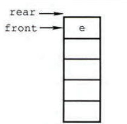
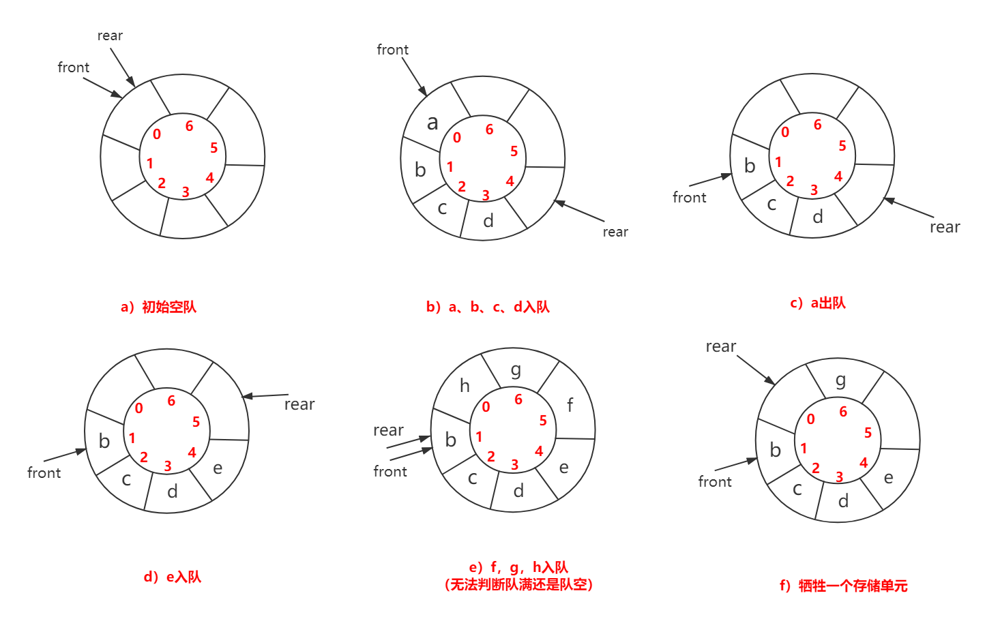
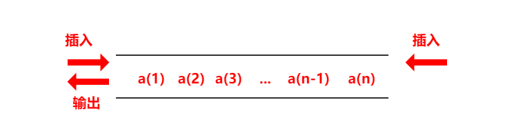
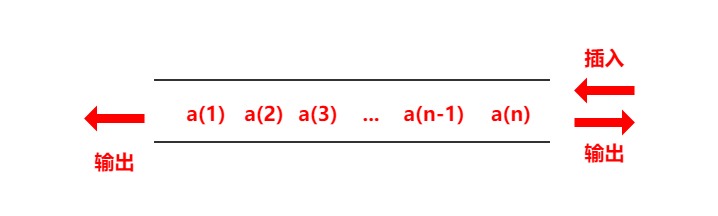

### 一、栈的应用

栈是一种先进后出(FILO)的数据结构

#### 1.1 栈的操作实现

1. 清空(clear)：

   ```c++
   // 栈的清空操作就是把栈顶top置为-1
   void clear(){
       top=-1;
   }
   // 清空栈，由于没有直接用于清空栈的元素，所以使用while和pop组合
   while(!st.size()) st.pop();
   ```

2. 获取栈内元素个数(size)：

   ```c++
   // 由于栈顶指针top始终指向栈顶元素，而下标是从0开始的，所以栈内元素要把top+1
   int size(){
       return top+1;
   }
   ```

3. 判空(empty)：

   ```c++
   // 由栈顶指针top判断的定义可知，仅当top==-1是为空，返回true，否则返回false
   bool empty(){
       if(top==-1) return true; //栈空
       else return false;  //栈非空
   }
   ```

4. 进栈(push)：

   ```c++
   // push(x)操作将元素x置于栈顶，由于top始终指向栈顶元素，所以需要把top+1然后再把x存入top位置
   void push(int x){
       st[++top]=x;
   }
   ```

5. 出栈(pop)：

   ```c++
   // pop()操作将栈顶元素出栈，而事实上可以将栈顶指针-1来实现这个效果
   void pop(){
       top--;
   }
   ```

6. 取栈顶元素(top)：

   ```c++
   // 由于栈顶指针top始终指向栈顶元素，所以st[top]就是栈顶元素
   int top(){
       return st[top];
   }
   ```

#### 1.2 STL中stack的常见用法

栈，后进先出(FILO)

1. stack的定义：

   ```c++
   // 定义一个stack需要添加头文件#include <stack>
   stack<int> st;
   ```

2. stack容器内的元素访问：

   ```c++
   // 只能通过top()函数来访问栈顶元素
   st.top();
   ```

3. push()函数：

   ```c++
   // push(x)将x入栈
   st.push(1);
   ```

4. top()函数：

   ```c++
   // top()函数获得栈顶元素
   st.top();
   ```

5. pop()函数：

   ```c++
   // 使用pop()函数弹出栈顶元素
   st.pop();
   ```

6. empty()函数：

   ```c++
   // empty()可以检测stack内是否为空，true为空，false为非空
   if(st.enpty()==true)
   ```

7. size()函数：

   ```c++
   // 通过size()函数来获得栈的元素个数
   st.size();
   ```

#### 1.3 使用队列实现栈

```c++
class MyStack {
public:
    /** Initialize your data structure here. */
    MyStack() {

    }
    
    /** Push element x onto stack. */
    void push(int x) {
		queue<int> tempQ;
		tempQ.push(x);
		while(!data.empty()) {
			tempQ.push(data.front());
			data.pop();
		}
		while(!tempQ.empty()){
			data.push(tempQ.front());
			tempQ.pop();
		}
    }
    
    /** Removes the element on top of the stack and returns that element. */
    int pop() {
		int ans = data.front();
		data.pop();
		return ans;
    }
    
    /** Get the top element. */
    int top() {
		return data.front();
    }
    
    /** Returns whether the stack is empty. */
    bool empty() {
		return data.empty();
    }
private:
	queue<int> data; 
};
```


### 二、队列

队列是一种先进先出的数据结构，通常用一个队首元素front指向**队首元素的前一个位置，**而使用队尾指针来指向队尾元素。

初始状态（队空条件）∶$Q.front() ==Q.rear()==0 $

进队操作∶队不满时，先送值到队尾元素，再将队尾指针加1

出队操作∶队不空时，先取队头元素值，再将队头指针加1

但 $Q.rear() == size$ 不能作为队满的条件。

如下图所示，$Q.rear() == size$ 满足前面的条件，但是显然，整个队列还有可以添加的其他元素的（未满）



#### 2.1 队列的操作实现

1. 清空(clear)：

   ```c++
   // 使用数组来实现队列是，初始状态为front=-1，rear=-1
   void clear(){
       front=rear=-1;
   }
   ```

2. 获得队列中的元素个数(size)：

   ```c++
   // rear-front是队列内元素的个数
   int size(){
       return rear-front;
   }
   ```

3. 判空(empty)：

   ```c++
   // 若rear等于front，则队列为空
   bool empty(){
       if(front==rear) return true;
       else return false;
   }
   ```

4. 入队(push)：

   ```c++
   // 入队，由于指针rear指向队尾元素，因此把元素入队时，需要先把rear+1，在存放到rear指向的位置
   void push(int x){
       q[++rear]=x;
   }
   ```

5. 出队(pop)：

   ```c++
   // 直接把队首指针加1来实现出队效果
   void pop(){
       front++;
   }
   ```

6. 取队首元素(get_front)：

   ```c++
   // 由于队首指针front指向的队首元素的前一个元素，因此front+1才是队首元素的位置
   int get_front(){
       return q[front+1];
   }
   ```

7. 取队尾元素(get_rear)：

   ```c++
   // 由于队尾指针rear指向的队尾元素，因此直接访问rear是队尾元素的位置
   int get_rear(){
       return q[rear];
   }
   ```

#### 2.2 STL中queue的常见用法

1. 判断队列是否为空 

```c++
Q.empty()
```

2. 返回队列头部元素

```c++
Q.front()
```

3. 返回队列尾部元素 

```c++
Q.back()
```

4. 弹出队列头部元素 

```c++
Q.pop()
```

5. 将x添加至队列 

```c++
Q.push(x)
```

6. 返回队列的存储元素的个数

```c++
Q.size()
```

#### 2.3 使用栈实现队列

```c++
class MyQueue {
public:
    /** Initialize your data structure here. */
    MyQueue() {

    }
    
    /** Push element x to the back of queue. */
    void push(int x) {
		stack<int> tempS;
		
		while(!data.empty()) {
			tempS.push(data.top());
			data.pop();
		}
		tempS.push(x);
		while(!tempS.empty()){
			data.push(tempS.top());
			tempS.pop();
		}
    }
    
    /** Removes the element from in front of queue and returns that element. */
    int pop() {
		int ans = data.top();
		data.pop();
		return ans;
    }
    
    /** Get the front element. */
    int peek() {
		return data.top();
    }
    
    /** Returns whether the queue is empty. */
    bool empty() {
		return data.empty();
    }
private:
	stack<int> data; 
};
```

#### 2.4 循环队列

如前面所讲，队列在判断队满的情况下力有不逮，所以就引出了循环队列。

将循环队列想象成一个环状的空间，即在逻辑上视为一个环。

初始时：$Q.front==Q.rear==0$

队首指针进1：$Q.front=(Q.front+1)\%MaxSize$

队尾指针进1：$Q.rear=(Q.rear+1)\%MaxSize$

队列长度：$len=(Q.rear+MaxSize-Q.front)\%MaxSize$

**为了区分队空还是队满的情况，有三种处理方式**∶

1. 牺牲一个单元来区分队空和队满，入队时少用一个队列单元，这是一种较为普遍的做法，约定以**"队头指针在队尾指针的下一位置作为队满的标志"**，如图下图e所示。


   队满条件：$(Q.rear+1)\%MaxSize==Q.front$

   队空条件仍：$Q.front==Q.rear$

   队列中元素的个数：$(Q.rear-Q.front+MaxSize）\% MaxSize$

2. 类型中增设表示元素个数的数据成员。这样，队空的条件为 $Q.size==0$；队满的条件为 $Q.size==MaxSize$；这两种情况都有 $Q.front==Q.rear$ 。


3. 类型中增设 tag 数据成员，以区分是队满还是队空。$tag == 0$ 时，若因删除导致 $Q.front==Q.rear$，则为队空；$tag==1$ 时，若因插入导致 $Q.front==Q.rear$，则为队满。





1. 初始化

```c++
void InitQueue(SqQueue &Q){
    Q.rear=Q.front=0;	// 初始化队首、队尾指针
}
```

2. 判队空

```c++
bool isEmpty(SqQueue &Q){
    if(Q.rear==Q.front) return true; 	// 队空条件
    else return false;
}
```

3. 入队

```c++
bool EnQueue(SqQueue &Q,ElemType x){
    if ((Q.rear+1)%MaxSize==Q.front) return false;	// 队满 
    Q.data[Q.rear]=x;	
    Q.rear= (Q.rear+1)%MaxSize; 	// 队尾指针加 1 取模
    return true;
}
```

4. 出队

```c++
bool DeQueue(SqQueue sQ,ElemType x){
    if(Q.rear==Q.front) return false;      //队空，报错
    x=Q.data[Q.front];
    Q.front=(Q.front+1)%MaxSize; 	//队头指针加 1 取模
    return true;
}
```


#### 2.5 双端队列

双端队列是指允许两端都可以进行入队和出队操作的队列，


输出受限的双端队列∶允许在一端进行插入和删除，但在另一端只允许插入的双端队列称为输出受限的双端队列，如下图



输入受限的双端队列∶允许在一端进行插入和删除，但在另一端只允许删除的双端队列称为输入受限的双端队列，如下图



### 三、STL容器中的queue和priority queue的实现方式

```c++
priority_queue<int> big_heap;//默认构造是最大堆
priority_queue<int, vector<int>, greate<int> > small_heap; //最小堆构造方法
priority_queue<int, vector<int>, less<int> > big_heap2;//最大堆构造方法

big_heap.empty()	// 判断堆是否为空 
big_heap.pop()		// 弹出堆顶元素（最大值） 
big_heap.push(x)	// 将元素x添加至二叉堆
big_heap.top()		// 返回堆顶元素（最大值） 
big_heap.size()		// 返回堆中元素个数
```


