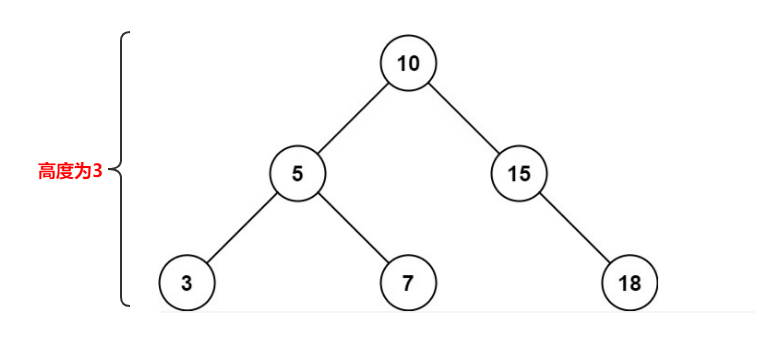
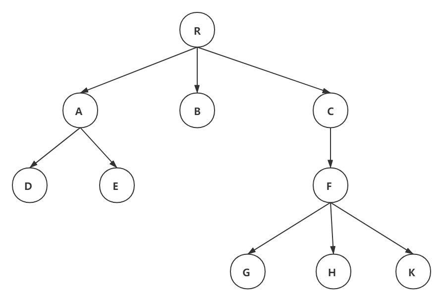
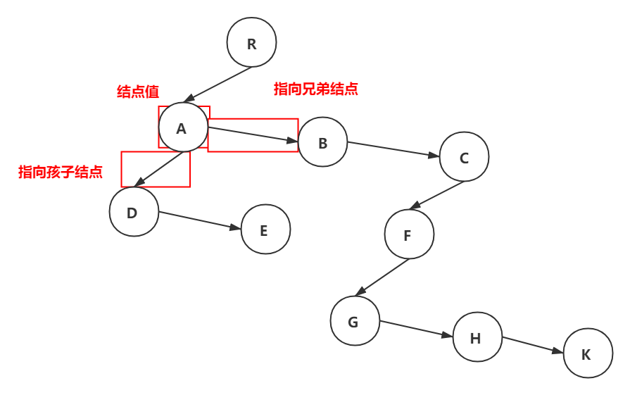
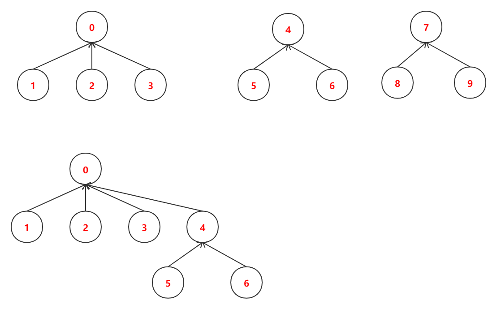

### 树的定义

**树**是一种数据结构，它是由 $n(n>=1)$ 个有限结点组成一个具有层次关系的集合。把它叫做 “树” 是因为它看起来像一棵倒挂的树，也就是说它是根朝上，而叶朝下的。它具有以下的特点

1. 每个结点有零个或多个子结点；
2. 没有父结点的结点称为根结点；
3. 每一个非根结点有且只有一个父结点；
4. 除了根结点外，每个子结点可以分为多个不相交的子树；

树适合于表示具有层次的数据。树中的某个结点（除了根结点）最多只和上一层的一个结点（及其父结点）有直接关系，根结点没有直接上层结点，因此在n个结点的树中有n-1条边。

而树中每个结点与其下一层的零个或多个结点（及其子女结点）有直接关系。

### 基本术语

 

以下概念不要求去记，理解概念即可，脑中要有图

祖先结点：根结点10到结点3的唯一路径上的任意结点，如结点10是结点3的祖先结点

子孙结点：如结点3是结点10的子孙结点

双亲结点：路径上最靠近结点3的结点，如5是3的双亲结点（注意，根结点是没有双亲结点的，如结点10）

孩子结点：如结点3是结点5的孩子结点

兄弟结点：有相同双亲的结点，如结点3和结点7有共同的双亲结点5，所以结点3和结点7是兄弟结点

结点的度：树中一个结点的子结点个数

树的度：树中结点最大度数

分支结点：度大于0的结点

叶子结点：度为0的结点

结点的层次：从树根开始定义，根结点为第1层，它的子结点为第2层，以此类推

结点的深度：从根结点开始自顶向下逐层累积的

结点的高度：从也结点开始自底向上逐层累积的

树的高度：树中结点的最大层数

有序树：树中结点的字数从左到右是有次序的，不能交换

无序树：不是有序树，就是无序树

路径：树中两个结点之间的所经过的结点序列构成的

路径长度：路径上所经过边的个数

森林：由$m(m≥0)$ 棵互不相交的树的集合。（树把根结点去掉就变成了森林，给n棵独立的树加上一个结点，并把这n棵树变成该结点的子树，则森林变成了树）

### 树的性质

树有这么几最基本的性质

1. 树中的结点数等于所有结点数的度数+1（这个1是根结点）
2. 度为m的树中第i层，最多有$m^{i-1}$ 个结点（$ i ≥ 1 $）
3. 高度为h的m叉树至多有$\frac{(m^h-1)}{(m-1)}$ 个结点
4. 具有n个结点的m叉树的最小高度为 $log_m(n(m-1)+1)(向上取整) $ 

### 树的存储结构

树的存储方式有很多种，既可以采用顺序存储，也可以采用连式存储。下面介绍3中常用的存储结构



**1. 双亲表示法**

这种存储方式采用一组连续空间来存储每个结点，同时在每个结点中增设一个伪指针，指示其双亲结点在数组中的位置。

| pos        |  0   |  1   |  2   |  3   |  4   |  5   |  6   |  7   |  8   |  9   |
| ---------- | :--: | :--: | :--: | :--: | :--: | :--: | :--: | :--: | :--: | :--: |
| **parent** |  -1  |  0   |  0   |  0   |  1   |  1   |  3   |  6   |  6   |  6   |
| **data**   |  R   |  A   |  B   |  C   |  D   |  E   |  F   |  G   |  H   |  K   |

> 解释：R是根结点，没有双亲结点，所以parent为-1；A，B，C是结点R的子结点，所以A，B，C的parent均为R的位置，也就是0；D，E是结点A的子结点，所以D，E的parent均为A的位置，也就是1；B没有子结点；F是结点C的子结点，所以F的parent为C的位置，也就是3；G，H，K是结点F的子结点，所以G，H，K的parent均为F的位置，也就是6

其存储结构可以是

```c++
struct TreeNode{
    int pos;
    char value;
    int parent;
    TreeNode *next;
}
```

这种存储结构的==优点== ：很快找到每个结点的双亲结点

==缺点== ：如果要求结点的孩子时，需要遍历整个结构

**2. 孩子表示法**

孩子表示法是将每个结点的孩子结点都用单链表接起来，形成一个线性结构，此时n个结点就有n个孩子链表

| pos  | value | child'pos1 | child'pos2 | child'pos3 | so on |
| :--: | :---: | :--------: | :--------: | :--------: | :---: |
|  0   |   R   |     1      |     2      |     3      |   -   |
|  1   |   A   |     4      |     5      |     -      |       |
|  2   |   B   |     -      |            |            |       |
|  3   |   C   |     6      |     -      |            |       |
|  4   |   D   |     -      |            |            |       |
|  5   |   E   |     -      |            |            |       |
|  6   |   F   |     7      |     8      |     9      |   -   |
|  7   |   G   |     -      |            |            |       |
|  8   |   H   |     -      |            |            |       |
|  9   |   K   |     -      |            |            |       |

> 解释：A，B，C是结点R的子结点，所以结点R子结点的位置为1，2，3；D，E是结点A的子结点，结点A的子结点位置为4，5；B没有子结点；F是结点C的子结点，C的子结点位置为6；G，H，K是结点F的子结点，F的子结点位置是7，8，9

其存储结构可以是

```c++
struct TreeNode{
    int pos;
    char value;
    vector<int> child;
    TreeNode *next;
}
```

这种存储结构的==优点== ：很快找到每个结点的结点

==缺点== ：如果要求结点的双亲时，需要遍历整个结构

**3. 孩子兄弟表示法**

孩子兄弟表示法又称二叉树表示法，即以二叉链表作为树的存储结构。

孩子兄弟表示法是每个结点包括三部分内容：结点值、指向结点第一个孩子结点的指针，及指向结点下一个兄弟结点的指针



### 树与森林的遍历


#### 树的遍历

树的遍历主要有先根遍历、后根遍历和层次遍历

先根遍历：若树非空，则先访问根结点，再按从左到右的顺序遍历根结点的每棵子树。如上图：RADEBCFGHK

```c++
void treePreOrder(TreeNode *node) {
    if(node==NULL) return;
    printf("%d",node->value);
    for(int i = 0; i< node.child.size(); i++) {
        treePreOrder(node.child[i]);
    }
    return;
}
```

后根遍历：若树非空，按从左到右的顺序遍历根结点的每棵子树，再访问根结点。如上图：DEABGHKFCR

```c++
void treeLastOrder(TreeNode *node){
    if(node==NULL) return;
    for(int i = 0; i< node.child.size(); i++) {
        treePreOrder(node.child[i]);
    }
    printf("%d",node->value);
    return;
}
```

层次遍历：

```c++
void treeLayerOrder(TreeNode *node){
    queue<int> q;
    q.push_back(node);
    while(!q.empty()){
        TreeNode *root = q.front();
        q.pop();
        printf("%d",node->value);
        for(int i = 0; i< node.child.size(); i++) {
        	q.push_back(node.child[i]);
    	}
    }
    return;
}
```

#### 森林遍历

**1. 先序遍历森林**

1. 访问森林中第一棵树的根结点
2. 先序遍历第一棵树中根结点的子树森林
3. 先序遍历除去第一棵树之后剩余的树构成的森林

**2. 中序遍历森林**

1. 中序遍历森林中第一棵树的根结点的子树森林
2. 访问第一棵树的根结点
3. 中序遍历除去第一棵树之后剩余的树构成的森林

### 并查集的应用

并查集是一种树型的数据结构，用于处理一些不相交集合的合并及查询问题（森林→树）。使用双亲表示法

原始的 parent 列表

|   位置   |  0   |  1   |  2   |  3   |  4   |  5   |  6   |  7   |  8   |  9   |
| :------: | :--: | :--: | :--: | :--: | :--: | :--: | :--: | :--: | :--: | :--: |
| 结点的值 |  0   |  1   |  2   |  3   |  4   |  5   |  6   |  7   |  8   |  9   |
| 双亲结点 |  -1  |  0   |  0   |  0   |  -1  |  4   |  4   |  -1  |  7   |  7   |

合并后parent 列表

|   位置   |  0   |  1   |  2   |  3   |  4   |  5   |  6   |  7   |  8   |  9   |
| :------: | :--: | :--: | :--: | :--: | :--: | :--: | :--: | :--: | :--: | :--: |
| 结点的值 |  0   |  1   |  2   |  3   |  4   |  5   |  6   |  7   |  8   |  9   |
| 双亲结点 |  -1  |  0   |  0   |  0   |  0   |  4   |  4   |  -1  |  7   |  7   |



并查集支持三种操作：1. 初始化，2. 寻找集合，3. 合并集合

```c++
// 初始化
void initialise(int parent[], int len) {
    for(int i = 0; i < len; i++) {
        // 记录当前结点的双亲结点
        parent[i] = -1;
        // 记录当前树高
        rank[i] = 1;
    }
    return;
}
// 寻找x的根
int find_node(int x, int parent[]) {
    int x_node = x;
    while(parent[x_node]!=-1) {
        x_node = parent[x_node];
    }
    return x_node;
}
// 合并，在合并的时候，要注意树的高度，应该把树低的树合并到树高的树中
int union(int x, int y, int parent[]) {
    int x_node = find_node(x,parent);
    int y_node = find_node(y,parent);
    // 在同一个集合里
    if(x_node==y_node) {
        return 0;
    } eles {
        // 不在同一个集合里
        if(rank[x_node] > rank[y_node]) {
            parent[y_node] = x_node;
        } else (rank[x_node] < rank[y_node]) {
            parent[x_node] = y_node
        } else {
       		parent[x_node] = y_node; // x_node的父结点在y_node的位置里
            rank[y_node]++;
        }
        return 1;
    }
}
```

