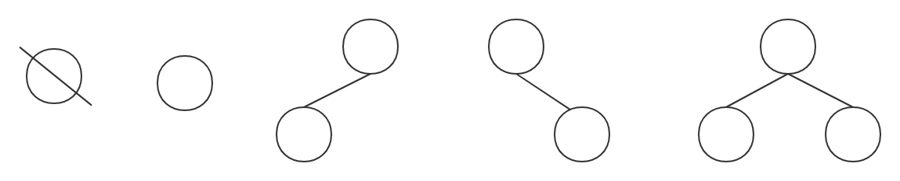
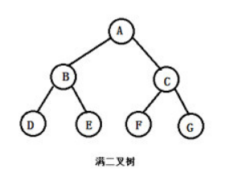
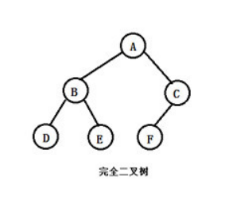
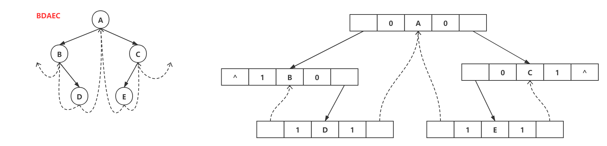
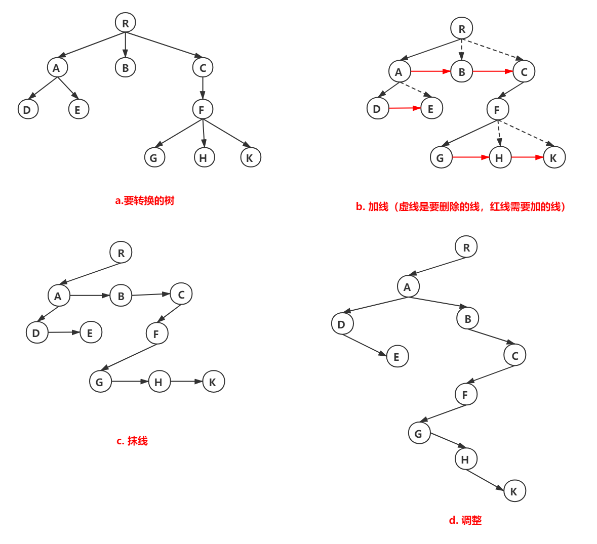
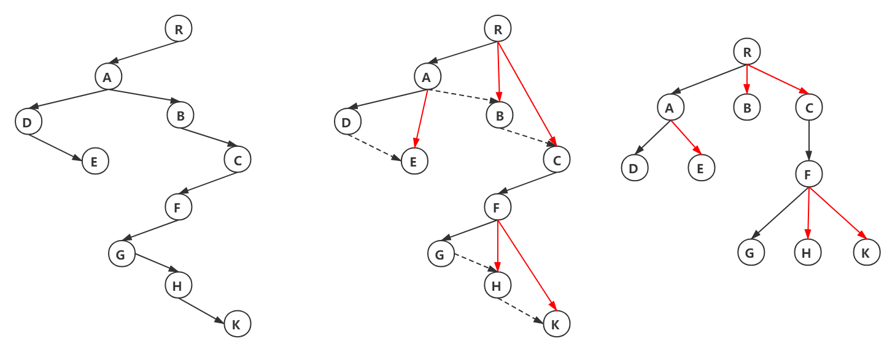
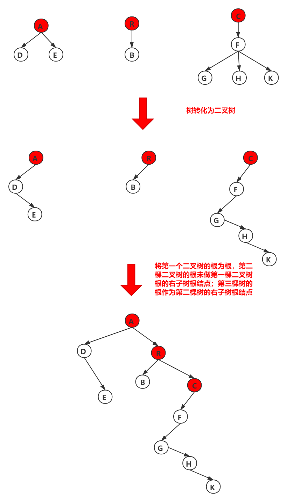
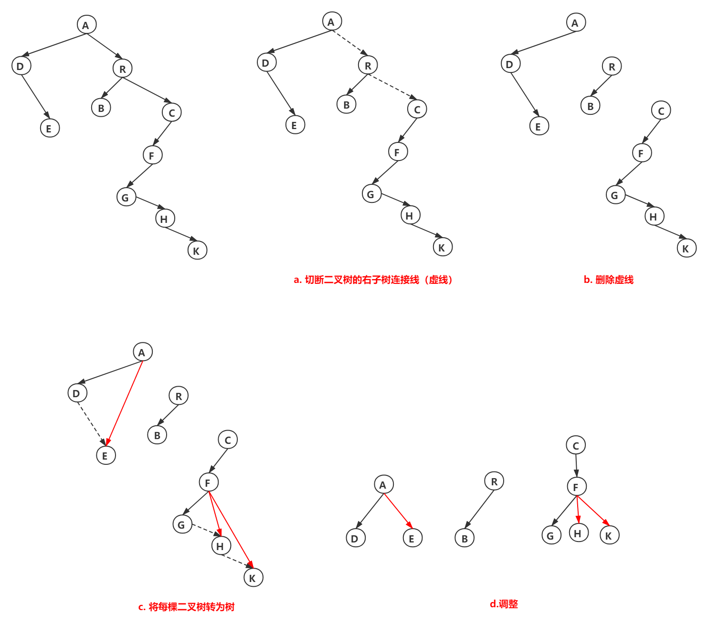

### 一、二叉树的定义及其主要特征

#### 1.1 二叉树的概念

二叉树是另一种树形结构，其特点是每个结点最多含两棵子树（也就是说，二叉树的度≤2）。

二叉树是一种有序树，若将其左、右子树颠倒，则成为另一颗不同的二叉树。

二叉树可以为空



#### 1.2 二叉树和度为2的有序树

在这里要区分一个概念，也就是二叉树和度为2的有序树之间的区别。

1. 度为2的树至少有3个结点，而二叉树则可以是一颗空树
2. 度为2的有序树的孩子结点，左右次序是相对于另一孩子结点而言的，若某个结点只有一个孩子结点，则这个结点就无须区分其左右次序。但，二叉树无论其孩子数是否为2，均需确定其左右次序，也就是说，二叉树的孩子结点的次序是绝对的。

#### 1.3 几种特殊的二叉树

**1. 满二叉树**

一颗高度为h，且含有$2^h-1$个结点的二叉树就是一颗满二叉树。



满二叉树的特点：

1. 每一层的结点个数为 $2^{h-1}$
2. 叶子结点之外的每个结点的度都是2
3. 叶子结点都位于同一层
4. 对整棵树按从1开始从上到下，自左向右编号，对于编号为i的结点，若有双亲，则双亲的位置 $\frac{i}{2}(向下取整)$，若有左孩子，则左孩子的编号为$2i+1$，若有右孩子，则右孩子的编号为$2i+2$，


**2. 完全二叉树**

设有一个高度为h，有n个结点的二叉树，当且仅当每个结点都与高度为h的满二叉树中编号1~n的结点一一对应时，就是一颗完全二叉树



完全二叉树的特点：

1. 叶子结点只可能在层次最大的两层上出现，且对于最大层次中叶子结点都依次排列在该层最左侧的位置
2. 若出现度为1的结点，有且仅有可能一个，且只有左孩子

**3. 二叉排序树**

一棵空树，或者是具有下列性质的二叉树：

1. 若左子树不空，则左子树上所有结点的值均小于它的根结点的值；
2. 右子树不空，则右子树上所有结点的值均大于或等于它的根结点的值；
3. 左、右子树也分别为二叉排序树；

**4. 平衡二叉树**

树上任一结点的左子树和右子树的深度不大于1

### 二叉树的存储结构

顺序存储结构：用一组地址连续的存储单元存储。满二叉树和完全二叉树使用较为合适。其他树使用数组中可能有空结点

链式存储结构：用指针指向根结点的孩子结点。二叉树的存储结构一般有三个域：1. 数据域data，2. 左指针域left，3. 右指针域right

```c++
struct BinaryTreeNode{
    int data;
    BinaryTreeNode *left;
    BinaryTreeNode *right;
};
```

### 二叉树的遍历

示例树如下：


**1. 先序遍历**

若二叉树为空，则什么都不做，否则

1. 访问根结点
2. 先序遍历左结点
3. 先序遍历右结点

以先序遍历方式遍历示例树，结果为：ABDECFG

```c++
void preorder(TreeNode *node, int layer) {
    if(!node) {
        return;
    }
    do something;
    preorder(node->left, layer + 1);
    preorder(node->right, layer + 1);
}
```

**2. 中序遍历**

若二叉树为空，则什么都不做，否则

1. 先序遍历左结点
2. 访问根结点
3. 先序遍历右结点

以中序遍历方式遍历示例树，结果为：DBEAFCG

```c++
void inorder(TreeNode *node, int layer) {
    if(!node) {
        return;
    }
    preorder(node->left, layer + 1);
    do something;
    preorder(node->right, layer + 1);
}
```

**3. 后序遍历**

若二叉树为空，则什么都不做，否则

1. 先序遍历左结点
2. 先序遍历右结点
3. 访问根结点

以后序遍历方式遍历示例树，结果为：DEBFCGA

```c++
void postorder(TreeNode *node, int layer) {
    if(!node) {
        return;
    }
    preorder(node->left, layer + 1);
    preorder(node->right, layer + 1);
    do something;
}
```

**4. 层次遍历**

要进行层次遍历，需要借助一个队列。先将二叉树根结点入队，然后出队，若它有左子树，则将左子树根结点入队；若它有右子树，则将右子树根结点入队。然后出队，对出队结点访问，如此反复，直到队列为空

以层序遍历方式遍历示例树，结果为：ABCDEFG

```c++
void Sequence(TreeNode *node) {
    queue<TreeNode *> q;
    q.push_back(node);
    while(!q.empty()) {
        TreeNode *root = node;
        q.pop();
    }
}
```

反过来讨论，给你一个中序序列和一个其他遍历序列能否构造出唯一一颗二叉树。答案是可以的。

如，先序序列：ABDECFG，中序序列：DBEAFCG

1. 先序序列第1个就是根结点，那么在中序序列中，以A为界，整个字符串分为两节，分别是DBE和FCG
2. 先序序列第2个就是其左子树的根结点，那么在中序序列中，以B为界，DBE字符串分为两节，分别是D和F，在B左边的就是B的左子树根结点，在B右边的就是B的右子树的根结点。
3. 同理推得A的右子树的根结点，往复循环即可。

### 线索二叉树

在二叉树的结点上加上线索的二叉树称为线索二叉树，对二叉树以某种遍历方式（如先序、中序、后序或层次等）进行遍历，使其变为线索二叉树的过程称为对二叉树进行线索化。

线索链表解决了无法直接找到该结点在某种遍历序列中的前驱和后继结点的问题，解决了二叉链表找左、右孩子困难的问题。

在二叉树线索化时，通常规定：若无左子树，令lchild指向其前驱结点；若无右子树，令rchild指向其后继结点

线索二叉树的存储结构：


```c++
struct ThreadBinaryTreeNode{
	int data;
    ThreadBinaryTreeNode *lchild;	// 指向左孩子结点
    ThreadBinaryTreeNode *rchild;	// 指向右孩子结点
    int ltag;		// 0表示结点的左孩子，1 表示结点的前驱
    int rtag;		// 0表示结点的右孩子，1 表示结点的后继
};
```




### 树转化为二叉树

树转换为二叉树的规则：每个结点左指针指向他的第一个孩子结点，右指针指向它在树中的相邻兄弟结点，可以表示为 ==**“左孩子右兄弟”**==。

将树转换成二叉树的步骤是：

1. 加线，就是在所有兄弟结点之间加一条连线；
2. 去线，就是对树中的每个结点，只保留他与第一个孩子结点之间的连线，删除它与其它孩子结点之间的连线
3. 调整，就是以树的根结点为轴心，将整棵树顺时针旋转一定角度，使之结构层次分明。



### 二叉树转换为树

二叉树转换为树是树转换为二叉树的逆过程，其步骤是：

1. 若某结点的左孩子结点存在，将左孩子结点的右孩子结点、右孩子结点的右孩子结点……都作为该结点的孩子结点，将该结点与这些右孩子结点用线连接起来；
2. 删除原二叉树中所有结点与其右孩子结点的连线；
3. 整理步骤1和步骤2两步得到的树，使之结构层次分明。




### 森林转化为二叉树

森林是由若干棵树组成，可以将森林中的每棵树的根结点看作是兄弟，由于每棵树都可以转换为二叉树，所以森林也可以转换为二叉树。

将森林转换为二叉树的步骤是：

1. 先把每棵树转换为二叉树；
2. 第一棵二叉树不动，从第二棵二叉树开始，依次把后一棵二叉树的根结点作为前一棵二叉树的根结点的右孩子结点，用线连接起来。
3. 当所有的二叉树连接起来后得到的二叉树就是由森林转换得到的二叉树。




### 二叉树转化为森林

二叉树转换为森林比较简单，其步骤如下：

1. 先把每个结点与右孩子结点的连线删除，得到分离的二叉树；（二叉树→森林）
2. 把分离后的每棵二叉树转换为树；（森林中的每棵树→二叉树）
3. 整理步骤2得到的树，使之规范，这样得到森林。

