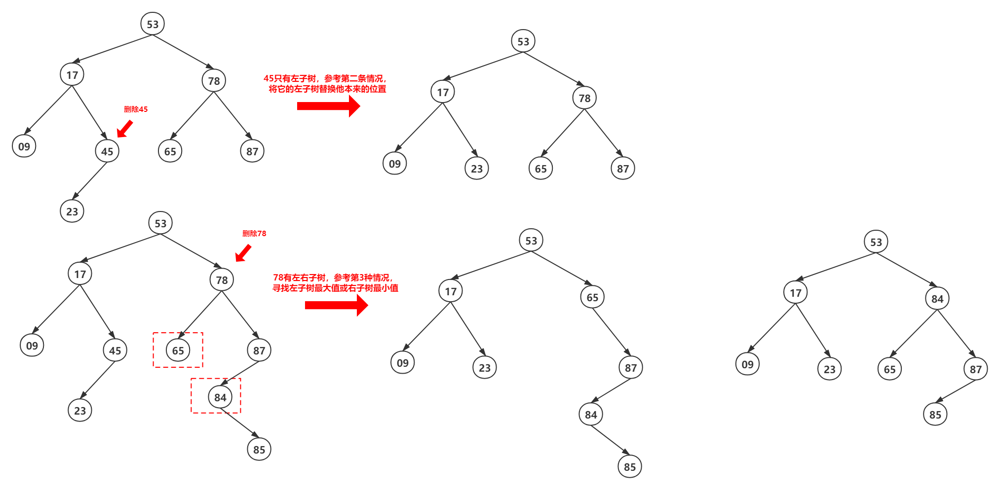

### 二叉排序树

#### 二叉排序树的定义

二叉排序树也称为二叉查找树。二叉排序树或者是一棵空树，或者是一棵具有如下特性的非空为茶树

1. 若==左子树非空==，则左子树所有结点关键字值均==小于==根结点的关键字值
2. 若==右子树非空==，则右子树所有结点关键字值均==大于==根结点的关键字值
3. 左右子树本身也分别为一棵二叉排序树

总结来说：左子树结点值 < 根结点值 < 右子树结点值

#### 二叉排序树的查找

步骤：

1. 若根结点关键字值等于目标值，返回true
2. 若根结点关键字值小于目标值 ，如果该根结点有左子树，则向左子树继续搜索；否则返回false
3. 若根结点关键字值大于目标值 ，如果该根结点有右子树，则向右子树继续搜索；否则返回false

```c++
bool BST_search(TreeNode *root, int value){
    if(root->val == value) return true;
    if(root->val > value) {
        if(root->left) {
            BST_search(root->left, value);
        } else {
            return false;
        }
    } else {
        if(root->right) {
            BST_search(root->right, value);
        } else {
            return false;
        }
    }
}
```

#### 二叉排序树的插入

步骤：

1. 若根结点关键字值小于插入值 ，如果该根结点有左子树，则向左子树继续搜索；否则插入，作为根结点的左子树
2. 若根结点关键字值大于插入值 ，如果该根结点有右子树，则向右子树继续搜索；否则插入，作为根结点的右子树

```c++
void BST_insert(TreeNode *node, TreeNode *insert) {
    if(node->val > insert->val) {
        if(node->left) {
            BST_insert(node->left, insert);
        } else {
            node->left = insert;
        }
    } else {
        if(node->right) {
            BST_insert(node->right, insert);
        } else {
            node->right = insert;
        }
    }
}
```

#### 二叉排序树的构造

二叉树的构造需要与二叉树的插入相结合

```c++
void create_BST(vector<int> nums, BSTNode *root) {	// root 的关键值是nums[0]
    int len = nums.size();
    int i = 1;
    while(i<len){
        BST_insert(root,nums[i]);
        i++;
    }
}
```

#### 二叉排序树的删除 

删除操作的实现过程按3种情况来处理：

1. 若被删除结点node是叶子结点，则直接删除
2. 若被删除结点只有一棵左子树或右子树，则让node的组数称为node双亲结点的子树，替代node的位置
3. 若结点node只有左、右两棵子树，则令node的直接后继（或其直接前驱）替代node，然后从二叉树排序中删去这个直接后继（或其直接前驱）—— 本质上就是去找左子树的最大关键字值和右子树最小树值



总结来说就一个标准，删除的结点后使删除后BST依旧符合BST的基本约束，同时使整棵树改变最少

#### 二叉排序树的查找效率

平均成功查找长度：==ASL~成功~ = $\frac{(层数)*(同层节点个数)}{n}$==

平均失败查找长度：==ASL~失败~ = $\frac{(层数)*(同层与该节点子节点情况类似个数)}{n+1}$==

详情参考文章【[【数据结构-查找】1.通俗易懂讲解 —— 顺序-折半-分块查找](https://blog.csdn.net/xt199711/article/details/112299202)】中的折半查找这一块

