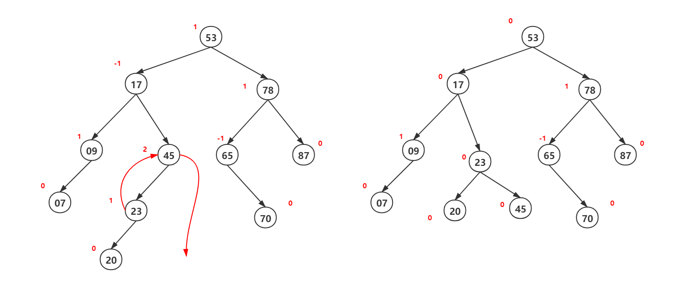
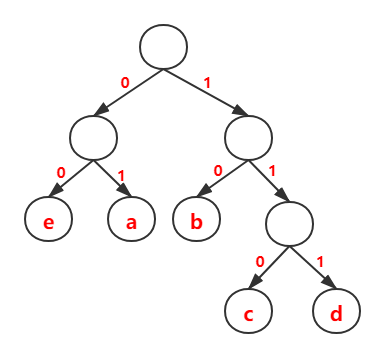

#### 一、平衡二叉树

##### 1.1 什么是平衡二叉树？

规定在插入和删除二叉树结点时，要保证任意结点的左、右子树高度之差的绝对值不可以超过1 

平衡因子：结点左子树和右子树的结点高度差为该结点的平衡因子，也就是说平衡树的平衡因子只可能是-1,0,1

如下图，结点53左子树高度为3，右子树高度为2，所以结点53的平衡因子为1.

##### 1.2 为什么需要平很二叉树？

为了避免树的高度增长过快，降低二叉树的性能

如下图，左边的图的最坏查找情况为O(n)，而右边图的最坏查找情况为O(logn)

##### 1.3 平衡二叉树的机制？

总纲：调整过程应该是自下而上的

无论是插入还是删除，改变一个结点的位置就会导致一棵二叉树的平衡因子改变。因此，在每插入或者删除一个结点之后，需要重新计算二叉树各个结点的平衡因子。若右结点的平衡因子大于1，那么需要调整这棵二叉树为平衡二叉树。当该树再次称为平衡二叉树之后，再进行下一步的插入或删除操作。

**1. LL型**

口诀：左失衡，中为支，高右旋

解释：如果对于LL型二叉树转为平衡二叉树不是很了解，背口诀套就是了。但是，终究要了解为什么这么做。在这一步的过程中，其实不需要死记硬背，只需要记住每一步的调整满足二叉排序的性质和定义，然后从整棵二叉树分析，在{20,23,45}，平衡因子在结点45时绝对值大于1，这么调整{20,23,45}为一棵平衡二叉树。显然，让中间结点23（23大于20且小于45）作为根，结点20和结点45分别作为结点23的左右孩子结点，符合调整意图

调整过程如下图所示

**2. RR型**

口诀：右失衡，中为支，高左旋

解释：同样的道理。从整棵二叉树分析，在{65,70,75}，平衡因子在结点65时绝对值大于1，这么调整{65,70,75}为一棵平衡二叉树。显然，让中间结点70（70大于65且小于75）作为根，结点65和结点75分别作为结点70的左右孩子结点，符合调整意图

调整过程如下图所示

**3. LR型**

口诀：下二整体左旋，后与LL型调整一样

解释：下二整体左旋的目的就是在局部形成类似LL型失衡情况一样。在这一步的过程中（下二整体左旋），同样不需要死记硬背，只要满足一棵二叉排序树就可以。比如下图的操作，将结点25作为结点23的双亲结点，同时，23比25小，所以结点23是结点25的左孩子结点。此时，整棵树就是LL型的二叉树

调整过程如下图所示

**4. RL型**

口诀：下二整体右旋，后与RR型调整一样

解释：下二整体右旋的目的就是在局部形成类似RR型失衡情况一样。在这一步的过程中，将结点68作为结点70的双亲结点，同时，70比68大，所以结点70是结点68的右孩子结点。此时，整棵树就是RR型的二叉树，做RR调整就可以了

调整过程如下图所示

#### 二、哈夫曼树

**1.1 什么是哈夫曼树？**

给定N个权值作为N个叶子结点，构造一棵二叉树，若该树的**带权路径长度达到最小**，称这样的二叉树为最优二叉树，也称为哈夫曼树

在深入了解哈夫曼树之前，我们需要先知道一些必要的基本概念。

> 1. 路径和路径长度：在一棵树中，从一个结点往下可以达到的孩子或孙子结点之间的通路，称为路径。通路中分支的数目称为路径长度。**若规定根结点的层数为1，则从根结点到第L层结点的路径长度为L-1。**
> 2. 结点的权及带权路径长度：若将树中结点赋给一个有着某种含义的数值，则这个数值称为该结点的权。结点的带权路径长度为：**从根结点到该结点之间的路径长度与该结点的权的乘积。**
> 3. 树的带权路径长度：**树的带权路径长度规定为所有叶子结点的带权路径长度之和**，记为WPL(Weighted Path Length)。

如下图：

图a：$WPL=7*2+5*2+2*2+4*2 = 36$

图b：$WPL=7*3+5*3+2*1+4*2 = 46$

图c：$WPL=7*1+5*2+2*3+4*3 = 35$

比较得知：图c中树的WPL最小，所以图3为一棵哈夫曼树

**1.2 为什么使用哈夫曼树？**

在计算机数据处理中，哈夫曼编码使用变长编码表对源符号进行编码，其中变长编码表是通过一种评估来源符号出现机率的方法得到的，出现机率高的字母使用较短的编码，反之出现机率低的则使用较长的编码，这便使编码之后的字符串的平均长度、期望值降低，从而达到无损压缩数据的目的。

简单的来说，就按出现的频率不同，把高频率出现的目标放在距离根结点近的位置，低频率出现的目标放在距离根结点源的位置，这样就使得查找效率提高。

**1.3 如何使用哈夫曼树？**

给定n个权值分别为 $w_1,w_2,…，w_n$ 的结点，通过哈夫曼算法可以构造出最优二叉树。

1. 将这n个结点分别作为n棵仅含一个结点的二叉树，构成森林。
2. 构成一个新的结点，从森林中选取两棵根结点最小的树作为新结点的左、右子树，并且将新结点的的权值置为左、右子树上根结点的权值和
3. 从森林中删除步骤2选出的树，同时将新得到的树放入森林中
4. 重复步骤2和3，直到森林中只剩下一棵树

哈夫曼树有如下特点：

1. 每个初始结点最终都成为叶结点，且权值越小的结点到根结点的路径越长
2. 构造过程中共新建了$n-1$个结点，因此哈夫曼树中的结点总数为 $2n-1$
3. 每次构造都选择2棵树作为新结点的孩子，因此哈夫曼树中不存在度为1的结点

**哈夫曼树的构造过程**

最后稳一点，大家认为哈夫曼树是唯一的嘛？显然不是。因为二叉树是分左右结点的，比如上图(c)中，结点c是双亲结点的左孩子结点，结点d是双亲结点的右孩子结点，二者交换位置也是可以的，并不影响整棵树是一棵哈夫曼树（WPL没有改变）。所以哈夫曼树答案不唯一。

**1.4 哈夫曼编码**

为使不等长编码为前缀编码(即要求一个字符的编码不能是另一个字符编码的前缀)，可用字符集中的每个字符作为叶子结点生成一棵编码二叉树，为了获得传送报文的最短长度，可将每个字符的出现频率作为字符结点的权值赋予该结点上，显然字使用频率越小权值越小，权值越小叶子就越靠下，于是频率小编码长，频率高编码短，这样就保证了此树的最小带权路径长度效果上就是传送报文的最短长度。

因此，求传送报文的最短长度问题转化为求由字符集中的所有字符作为叶子结点，由字符出现频率作为其权值所产生的哈夫曼树的问题。利用哈夫曼树来设计二进制的前缀编码，既满足前缀编码的条件，又保证报文编码总长最短。

若没有一个编码是另一个编码的前缀，则称这样的编码为前缀编码。

通过前缀编码解码，可以辨识出第一个编码，并将编码翻译为源原码。

例如：00101100，可以唯一被解读为：0、0、101、100

下面举个例子

a：01

b：10

c：110

d：111

e：00

通过上面的例子可以看出，对于每个叶子结点上的值都有唯一的编码