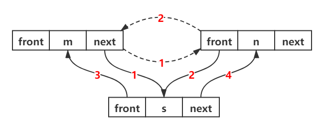
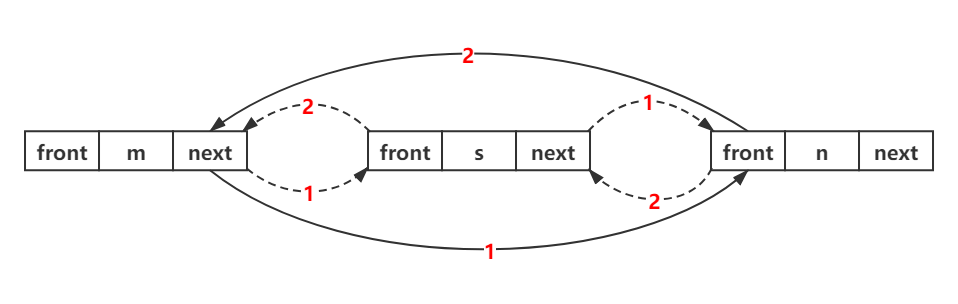
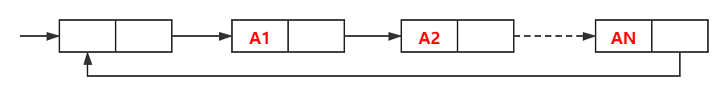
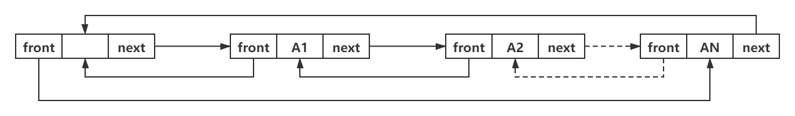

#### 链表的操作

##### 链表中的插入（头插）

```c++
void *insertNode(ListNode *head, ListNode *node) {
    node->next = head;
    head = node;
    return; 
}
```

##### 链表中的插入（尾插）

```c++
void *insertNode(ListNode *head, ListNode *node) {
    ListNode *front = head;
    while(head)  {
        // 备份前一个节点
        front = head;
        head = head->next;
    }
    front->next = node;
    return; 
}
```

##### 链表中的插入

```c++
void *insertNode(ListNode *head, ListNode *node) {
    // 插入到结点7之后
    while(head&&!head->val==7)  head = head->next;
    // 先将结点7下一个结点的地址赋值给node的指针
    node->next = head->next;
    // 将node作为下一个结点
    head->next = node;
    return; 
}
```

##### 链表中的删除

```c++
void *deleteNode(ListNode *head, ListNode *node) {
	ListNode *front = head;
    while(head&&!head==node)  {
        // 备份前一个节点
        front = head;
        head = head->next;
    }
    front->next = head->next;
    return; 
}
```

##### 链表中的查找

```c++
bool *deleteNode(ListNode *head, int value) {
    while(head&&!head->val==value)  {
        head = head->next;
    }
    if(head==NULL) return false; 	// 没找到
    else return true;	// 找到了
}
```

#### 链表操作的一些技巧

1. 链表精髓在于指针移动
2. 特别注意 空指针 时的情况，无论开头还是结尾都要考虑，尤其是 p->next == NULL ? 要特别注意

##### 类型一：反转数列

```c++
ListNode *reverseList(ListNode *head, int mid) {
    ListNode *newHead = NULL;
    while(mid--) {
        // 备份主链的下一个节点 
        ListNode *node = head->next;
        // 更新head的next指针，指向子链头指针 
        head->next = newHead;
        // 更新子链头指针 
        newHead = head;
        // 更新主链头指针 
        head = node;
    }
    return newHead; 
}
```

##### 类型二：快慢指针

第几第几这种可以使用快慢指针或者双指针

```c++
ListNode *detectCycle(ListNode *head) {
    ListNode *fast = head;
    ListNode *slow = head;
    ListNode *meet = NULL;
    while(fast&&fast->next&&fast->next->next) {
        fast = fast->next->next;
        slow = slow->next;
        if(fast==slow) {
             meet = fast;
            break;
        }
    }
    if(fast==NULL||fast->next==NULL||fast->next->next==NULL) {
        return NULL;
    }
    while (head) {
        if(meet == head) {
            return meet;
        }
        meet = meet -> next;
        head = head -> next;
    }
    return NULL;
}
```

##### 类型三：巧设头指针

```c++
ListNode* partition(ListNode* head, int x) {
    ListNode frontHead(0);
    ListNode afterHead(0);
    ListNode *front = &frontHead;
    ListNode *after = &afterHead;
        
    while (head) {
        if (head->val < x) {
             front -> next = head;
            front = head;
        } else {
            after -> next = head;
            after = head;
        }
        head = head -> next;
    }
    front->next= afterHead.next;
    after->next = NULL;
    return frontHead.next;
}        
```

##### 类型四：创建新节点

```c++
ListNode* addTwoNumbers(ListNode* l1, ListNode* l2) {
    // 巧设头结点 
    ListNode a(0);
    ListNode *ans = &a;
    int carry = 0;
    ListNode *p = NULL;  // 精髓
    while(l1&&l2) {
        int num = l1->val+l2->val + carry;
        if(num>=10){
            int rest = num % 10;
            carry = 1;
            p = new ListNode(rest); // 精髓
            ans->next = p;
            // 移动ans指针 
            ans = p; 
        } else {
            carry = 0;
            p = new ListNode(num);
            ans->next = p;
            // 移动ans指针 
            ans = p; 
        } 
        l1 = l1->next;
        l2 = l2->next;
    }
    while(l1) {
        int num = l1->val + carry;
        if(num>=10){
            int rest = num % 10;
            carry = 1;
            p = new ListNode(rest);
            ans->next = p;
            // 移动ans指针 
            ans = p; 
        } else {
            carry = 0;
            p = new ListNode(num);
            ans->next = p;
            // 移动ans指针 
            ans = p; 
        } 
            l1 = l1->next;
    }
    
    while (l2) {
        int num = l2->val + carry;
        if(num>=10){
            int rest = num % 10;
            carry = 1;
            p = new ListNode(rest);
            ans->next = p;
            // 移动ans指针 
            ans = p; 
        } else {
            carry = 0;
            p = new ListNode(num);
            ans->next = p;
            // 移动ans指针 
            ans = p; 
        } 
        l2 = l2->next;
    }
    return a.next; 
}
```

#### 双链表

为了克服单链表的上述缺点，引入了双链表，双链表结点中有两个指针 front 和 next，分别指向其前驱结点和后继结点

**双链表的插入**

```c++
// 将node插入到head之后
node->next = head->next;	// ①
head->next->front = node;	// ②
node->front = head;		// ③
head->next = node;		// ④
```



**双链表的删除**

```c++
head->next = node->next;	// ①
node->next->front = head;	// ②
```



#### 循环链表

**循环单链表**：循环单链表和单链表的区别在于，表中最后一个结点的指针不是NULL，而改为指向头结点，从而整个链表形成一个环



**循环双链表**：由循环单链表的定义不难推出循环双链表，不同的是在循环双链表中，头结点的 prior指针还要指向表尾结点

在循环双链表工中，某结点*p为尾结点时，`p->next==L;` 当循环双链表为空表时，其头结点的 front 域和 next 域都等于 L。



